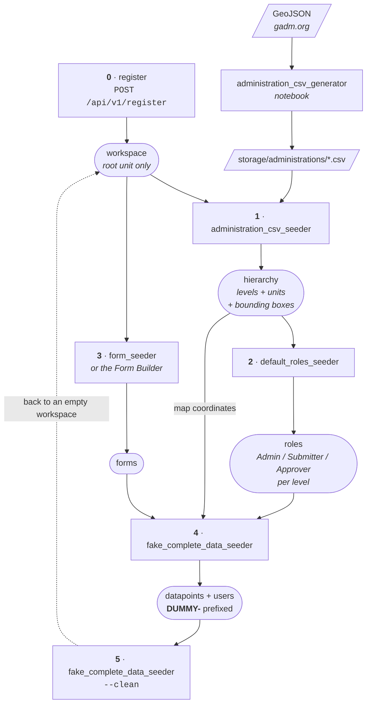

# Akvo MIS

[](https://github.com/akvo/akvo-mis/actions/workflows/main.yml?query=branch%3Amain) [](https://github.com/akvo/akvo-mis/actions/workflows/apk-release.yml?query=branch%3Amain) [](https://img.shields.io/github/repo-size/akvo/akvo-mis) [](https://img.shields.io/github/languages/count/akvo/akvo-mis) [](https://img.shields.io/github/issues/akvo/akvo-mis) [](https://img.shields.io/github/last-commit/akvo/akvo-mis/main) [](https://coveralls.io/github/akvo/akvo-mis) [](https://akvo-mis.readthedocs.io/en/latest)

Real Time Monitoring Information Systems

## Prerequisite

- Docker > v19
- Docker Compose > v2.1

## Development

### Environment Setup

Ensure that PORT 5432 and 3000 are not being used by other services.

Copy `env.example` to create a `.env` file. Here’s what it should look like:

.env

```bash
APP_NAME="Akvo MIS"
APP_SHORT_NAME="akvo-mis"
APK_NAME="MIS Mobile"
APK_SHORT_NAME="mis-mobile"
DB_HOST=db
DB_PASSWORD=password
DB_SCHEMA=mis
DB_USER=akvo
DEBUG="True"
DJANGO_SECRET=local-secret
GOOGLE_APPLICATION_CREDENTIALS
MAILJET_APIKEY
MAILJET_SECRET
WEBDOMAIN
EXPO_TOKEN="<<your secret expo token>>"
POSTGRES_PASSWORD=password
PGADMIN_DEFAULT_EMAIL=dev@akvo.org
PGADMIN_DEFAULT_PASSWORD=password
PGADMIN_LISTEN_PORT="5050"
IP_ADDRESS="http://<your_ip_address>:3000/api/v1/device"
APK_UPLOAD_SECRET="123456789AU"
STORAGE_PATH="./storage"
BASE_DOMAIN=
EMBED_HOST=
SENTRY_DSN="<<your sentry DSN for BACKEND>>"
SENTRY_MOBILE_ENV="<<your sentry env>>"
SENTRY_MOBILE_DSN="<<your_sentry_mobile_DSN>>"
SENTRY_MOBILE_AUTH_TOKEN="<<your_sentry_mobile_auth_token>>"
```


You can generate a Sentry auth token by following [this official Sentry documentation](https://docs.sentry.io/account/auth-tokens/).

#### Workspaces (multi-tenancy)

The app is multi-tenant. Every workspace owns its own administrative
hierarchy, forms, users and data, and nothing is shared between them.

`BASE_DOMAIN` decides whether workspaces get their own hosts:

| `BASE_DOMAIN` | Behaviour |
|---|---|
| empty (**default**) | Single host. Every request is the base domain, no host resolves to a workspace, and the app behaves as it did before workspaces existed. |
| e.g. `localapp.test` | Each workspace lives at `<subdomain>.<BASE_DOMAIN>`, and a session is only valid on its own workspace's host. |

Leave it empty unless you are working on subdomain routing — see
[Subdomain routing locally](#subdomain-routing-locally) below.

A migrated database always has one workspace called `default`, created by
the tenant backfill migration, so the seeders have something to target
before anyone registers. Commands that write workspace-owned rows take
`--tenant=<subdomain>`.

#### Embedded dashboards

A dashboard can show a report built in an external tool — Power BI,
Tableau, Looker Studio. The author pastes in the embed snippet the
vendor's Share dialog gives them, which is HTML with `<script>` tags that
we did not write and cannot vet.

**`EMBED_HOST` exists because that snippet has to run somewhere, and
there are only three candidates.**

*In the app's own page.* Then it is JavaScript running in our origin, on
a page anonymous visitors can load. It can read the DOM, and it can read
`AUTH_TOKEN` out of `document.cookie` — that cookie is not `HttpOnly` —
so a snippet could take over the session of any administrator who opens
the dashboard. This is not an option, however convenient.

*In a sandboxed frame with no origin of its own* (`srcdoc` without
`allow-same-origin`). Properly isolated, and the vendors do not work
there: the document's origin is the string `"null"`, so Tableau's API
requests are refused by CORS and Power BI cannot reach its own storage.
Tried, measured, abandoned.

*On a host of its own.* The snippet gets a real origin, so the vendors
behave normally, and it is not our origin, so the same-origin policy
keeps it away from our page exactly as it does any third-party iframe.
That host is `EMBED_HOST`, and this is the whole reason the setting
exists.

| `EMBED_HOST` | Behaviour |
|---|---|
| empty (**default**) | Embedding is off. The create dialog does not offer it, the embed route answers 404, and any embedded dashboards that already exist stay listed and editable while reporting that their content cannot be shown. Every other kind of dashboard is unaffected. |
| e.g. `https://embed.example.com` | Embedded dashboards render. The host must resolve, serve TLS, and route `/api` to the backend the way the app's own host does. |

**Leaving it empty is a supported state**, not a broken one. Set it only
for deployments that want embedded dashboards.

**Choosing a value.** Any hostname that is not the app's own will do.
With `BASE_DOMAIN` set, a name one level under it — `embed.<BASE_DOMAIN>`
— is covered by the existing wildcard certificate. Without one
(single-tenant and legacy deployments) the rule is the same, but the
certificate is its own piece of work since there is no wildcard to lean
on. It must never be the app's own origin: the backend refuses to serve
the document to a request whose `Host` is not `EMBED_HOST`, the frontend
refuses to frame a URL on its own origin, and registration refuses a
workspace whose host would equal it, but the first line of defence is
not pointing it there.

There is deliberately **no derived default** such as `embed.<BASE_DOMAIN>`.
Deriving a name does not create the DNS record or the certificate, and a
cross-origin frame reports nothing back to us — so a plausible-but-wrong
default produces a blank panel and nothing in any log, where an empty
value produces a sentence on screen.

A sibling subdomain is enough because this app sets no domain-wide
cookies (`AUTH_TOKEN` is host-only; `SESSION_COOKIE_DOMAIN` and
`CSRF_COOKIE_DOMAIN` are unset). If one is ever introduced, `EMBED_HOST`
has to move to a separate registrable domain.

**Locally**, add a host entry as for any workspace and point the variable
at the backend's port, since Django serves the document:

```
127.0.0.1  embed.localapp.test
```

```bash
EMBED_HOST=http://embed.localapp.test:8000
```

Then `./dc.sh up -d --force-recreate backend worker`.

#### Subdomain routing locally

`/etc/hosts` stands in for the wildcard DNS that production uses, and the
flow you get is the same one production has. Full walkthrough:
[`doc/notes/subdomain-local-dev.md`](doc/notes/subdomain-local-dev.md).

**One-time setup**

1. Pick a base domain you do not own on the real internet — `.test` is
   reserved for exactly this by RFC 2606 — and set it in `.env`:

   ```bash
   BASE_DOMAIN=localapp.test
   ```

2. Add it to `/etc/hosts`:

   ```
   127.0.0.1  localapp.test
   ```

3. Restart so the backend and worker pick up the variable and the frontend
   bakes it into `config.js`:

   ```bash
   ./dc.sh up -d --force-recreate backend worker frontend
   ```

`http://localapp.test:3000` is now the main site: registration and a
find-workspace field, no login.

**Per workspace**

`/etc/hosts` has no wildcard, so every workspace needs its own line. This
is the only repeated step.

1. Register at `http://localapp.test:3000/register`, say `new-tenant`.
2. Add its host:

   ```
   127.0.0.1  new-tenant.localapp.test
   ```

3. Read the activation email at [localhost:8025](http://localhost:8025)
   (Mailpit). The link already points at
   `http://new-tenant.localapp.test:3000/activate/...`, because activation
   hands back a session and that session is only valid there.
4. Follow it, complete the configuration form, and use the app on that host.

**Four things that will bite you**

- **The base domain and the workspace hosts must share a suffix.** The
  resolver strips `BASE_DOMAIN` off the host and looks up what is left, so
  `BASE_DOMAIN=localapp.test` with a browser on `acme.localhost` resolves to
  nothing and answers 404.
- **`ALLOWED_HOSTS` must accept the subdomains.** It is `["*"]` today. If
  that is ever tightened, Django's leading-dot form is the subdomain
  wildcard: `.localapp.test`.
- **The dev proxy must forward the browser's Host.** `setupProxy.js` sets
  `changeOrigin: false` for this reason — with it on, every request reaches
  Django as `127.0.0.1:8000` and no workspace ever resolves.
- **The port is part of the local address.** The resolver strips it, but
  redirects and emailed links carry it, so `http://acme.localapp.test`
  without `:3000` reaches nothing.

**Without hosts entries:** `curl -H "Host: acme.localapp.test" ...` reaches a
workspace from a shell. Only the browser needs `/etc/hosts`, because only the
browser resolves the name. Tests need nothing at all — the Django test client
takes the host as an argument, and `BASE_DOMAIN` is forced empty under
`manage.py test`, so a test that wants host routing opts in with
`override_settings`.

#### Start

The frontend's `node_modules` live in a named Docker volume that is declared
`external`, so Docker never creates it automatically. On **every** operating
system (Linux, macOS and Windows) you must create it once before the first run,
otherwise `docker compose up` aborts with an _"external volume not found"_
error:

```bash
docker volume create akvo-mis-docker-sync
```

Then start the stack:

```bash
./dc.sh up -d
```

> **Note:** the separate `docker-sync` tool is **not** required on any OS — the
> stack uses this named volume with native bind mounts. The legacy
> `docker-sync.yml` in the repo is only an optional file-sync accelerator for
> macOS/Windows Docker Desktop and can be ignored.

##### Adjusting volume permissions on Linux

On a standard Docker Engine setup the frontend container runs as `root` and
installs `node_modules` into the volume without trouble. On some Linux
configurations — **rootless Docker**, **user-namespace remapping**, or an
**SELinux-enforcing** host — the container cannot write into the freshly
created (root-owned) volume, and startup fails with a _permission denied_ /
`EACCES` error while installing dependencies.

If that happens, fix the volume's ownership with a throwaway container — no
`sudo`, and no need to touch `/var/lib/docker/volumes` directly:

```bash
# Own the volume as your host user (fixes rootless / userns-remap setups)
docker run --rm -v akvo-mis-docker-sync:/data alpine \
    chown -R "$(id -u):$(id -g)" /data
```

On an **SELinux** host the volume is readable but mislabeled; relabel it for
container access instead (run on the host, where `chcon` is available):

```bash
sudo chcon -Rt svirt_sandbox_file_t \
    "$(docker volume inspect akvo-mis-docker-sync --format '{{.Mountpoint}}')"
```

Then re-run `./dc.sh up -d`.

The development site should be running at: [localhost:3000](http://localhost:3000). Any endpoints with prefix

- `^/api/*` is redirected to [localhost:8000/api](http://localhost:8000/api)
- `^/static-files/*` is for worker service in [localhost:8000](http://localhost:8000/static-files)

Network Config:

- [setupProxy.js](https://github.com/akvo/akvo-mis/blob/main/frontend/src/setupProxy.js)
- [mainnetwork](https://github.com/akvo/akvo-mis/blob/docker-compose.override.yml#L4-L8) container setup

Add New User and Seed Master Data:

Once the containers are up and running, you can seed the necessary data by running the following command:

```bash
./dc.sh exec backend ./seeder.sh --tenant=default
```

`--tenant` is required. It names the workspace the forms and generated data
belong to; `default` exists on any migrated database. Every tenant-aware
command in the script reuses that one value, which is why it is an argument
rather than a prompt.

The script then asks whether to run each step:

- seed administrative data (a CSV import, or the small bundled sample)
- seed forms
- add a new super admin
- seed organisations and administration attributes
- seed default roles
- seed fake data

Answer each prompt by entering 'y' or 'n' followed by the Enter key. The fake
data step asks for nothing beyond counts — map coordinates come from the
hierarchy imported in the first step. See
[Fake Data (Development)](#fake-data-development) for running each seeder on
its own.

Default Fake User's password: `Test#123`

Generate QR Code for Mobile App Download:

To generate a QR code image for the mobile app download link, run:

```bash
./dc.sh exec backend python manage.py generate_qr_code
```

This generates a QR code PNG image at `storage/images/download-app.png` encoding the default URL (`WEBDOMAIN/app`).

To specify a custom URL:

```bash
./dc.sh exec backend python manage.py generate_qr_code --url https://example.com/app
```

Refresh Materialized Views:

Manage Data's monitoring overview reads from the `view_data_options`
materialized view. By default, `generate_config` (run on backend startup, by
the seeder, and lazily by the `/config-file` endpoint when the JS bundle is
missing) **does not** refresh this view because `REFRESH MATERIALIZED VIEW`
acquires an `ACCESS EXCLUSIVE` lock that blocks readers and writers for the
full refresh duration. `CONCURRENTLY` is not used because
`refresh_materialized_data()` runs inside `@transaction.atomic`.

Routine refreshes already happen as part of the data seeders
(`fake_complete_data_seeder`, `flow_data_seeder`) and the
`v1_data.tasks.refresh_materialized_data` async task. To refresh explicitly
during a maintenance window:

```bash
./dc.sh exec backend python manage.py generate_config --refresh-views
```

#### Log

```bash
./dc.sh logs --follow <container_name>
```

Available containers:

- backend
- worker
- frontend
- mainnetwork
- db
- pgadmin
- mailpit

#### Stop

```bash
./dc.sh stop
```

#### Teardown

```bash
./dc.sh down -t1
docker volume rm akvo-mis-docker-sync
```

## Mobile App Development

For initial run, you need to create a separate docker volume.

```bash
docker volume create akvo-mis-mobile-docker-sync
```

```bash
./dc-mobile.sh up -d
```

1. Install the [**Expo Go**](https://play.google.com/store/apps/details?id=host.exp.exponent&hl=en&gl=US&pli=1) app from Playstore
2. Connect your android to the same wireless network as your machine.
3. Open The Expo Go
4. Enter URL Manually: `Your_IP_Address:19000`

#### Teardown Mobile App

```bash
./dc-mobile.sh down -t1
```

## Production

```bash
export CI_COMMIT='local'
./ci/build.sh
```

Above command will generate three docker images with prefix `eu.gcr.io/akvo-lumen/akvo-mis` — `backend`, `frontend` and `worker`

```bash
docker-compose -f docker-compose.yml -f docker-compose.ci.yml up -d
```

Network config: [nginx](https://github.com/akvo/akvo-mis/blob/main/frontend/nginx/conf.d/default.conf)


## Dashboard Visualizations

Dashboards are **authored in the app by each workspace**, not configured in the
repo. A dashboard is a database row owned by a tenant, plus one row per widget —
nothing ships in the frontend bundle, and adding one requires no code change and
no deploy.

Screens:

| Route | Purpose | Permission |
|---|---|---|
| `/control-center/dashboard` | List and create | `dashboard_view` / `dashboard_create` |
| `/control-center/dashboard/:slug` | Builder — drag widgets onto a 24-column grid | `dashboard_edit` |
| `/dashboards/:slug` | Viewer — what colleagues see | `dashboard_view` |

To add a dashboard: open `/control-center/dashboard` and click Create. A
dashboard is either built here — pick a name and a root registration form,
which fixes its data universe and cannot be changed later, then add widgets
— or it embeds a report from an external tool, in which case you paste that
tool's embed snippet instead. Either way, press Publish. The embed option
appears only where [`EMBED_HOST`](#embedded-dashboards) is configured.

Widget types are `kpi`, `bar`, `line`, `pie`, `table`, `map` and
`section_title`. Every chart is rendered by [akvo-charts](https://akvo.github.io/akvo-charts);
no module under `frontend/src/components/dashboard/` imports `echarts` directly.

Editing a published dashboard is safe: viewers keep reading the last published
snapshot (`published_config`) until Publish is pressed again. A widget whose
question was deleted in the form builder renders a placeholder in its own grid
cell rather than failing the page.

Three API namespaces:

- `/api/v1/manage/dashboards` — authoring, authenticated (Swagger tag
  **Manage Dashboards**)
- `/api/v1/dashboards` — published reads (Swagger tag **Dashboards**).
  Anonymous callers reach the dashboards a workspace has marked public;
  everything else needs a session.
- `/api/v1/embed/<token>` — one embedded dashboard's external markup,
  served only on `EMBED_HOST` (see
  [Embedded dashboards](#embedded-dashboards))

Design docs: [VIZ-001](doc/design/VIZ-001-dashboard-builder-data-architecture.md)
covers the data model, widget config schema and the `measure` semantics;
`doc/design/VIZ-002` … `VIZ-009` cover the individual slices.

> The previous file-based system — JSON configs under
> `frontend/src/config/visualizations/` rendered at an anonymous
> `/dashboard/:formId` — was removed in VIZ-009. Its two configs were not
> migrated: they encoded compute modes the current schema deliberately does not
> have, so there was no mechanical path from one to the other.

## Data Seeder

### Fake Data (Development)

Building a workspace up from nothing. Every command below is tenant-aware and
takes `--tenant <subdomain>`.



#### 0. Create a workspace

Registration is the only thing that creates one. It is a two-phase flow: sign
up claims the subdomain, then a configuration form names the top tier and its
root unit.

```bash
curl -X POST http://localhost:3000/api/v1/register \
    -H 'Content-Type: application/json' \
    -d '{"email":"you@example.org","password":"Secret#Pass123","subdomain":"acme"}'
```

The account starts inactive. Read the activation email at
[localhost:8025](http://localhost:8025) (Mailpit), follow the link, and fill in
the configuration form — it asks for the top tier's name ("National") and the
unit at it ("Indonesia"), which are two different things.

If you are working on subdomain routing, each workspace also needs an
`/etc/hosts` line — see
[Subdomain routing locally](#subdomain-routing-locally). With `BASE_DOMAIN`
empty, the default, host routing is inert and you can skip that.

**Or skip registration entirely:** a migrated database already has a `default`
workspace (created by the tenant backfill migration), which is what a
single-host install uses. `--tenant default` works immediately after `migrate`.

#### 1. Import an administration hierarchy

A freshly registered workspace has one level and one root unit and nothing
below it. `administration_csv_seeder` imports the rest from a CSV, creating
both the `Levels` and the `Administration` rows in one step:

```bash
./dc.sh exec backend python manage.py administration_csv_seeder \
    --source=administrations/indonesia.csv --tenant=acme --dry-run

./dc.sh exec backend python manage.py administration_csv_seeder \
    --source=administrations/indonesia.csv --tenant=acme
```

| Flag | Purpose |
|---|---|
| `--source=<path>` | **Required.** CSV to import, resolved against `STORAGE_PATH` first, then as a literal path |
| `--tenant=<subdomain>` | **Required.** Workspace to import into |
| `--dry-run` | Validate the whole file and roll back, writing nothing |
| `--rename-root` | Allow the level-0 column to rename the workspace's existing root unit |

Run `--dry-run` first. `STORAGE_PATH` is bind-mounted from the repo's
`storage/` directory — country files are operator data and are gitignored
there.

A four-tier example ships with the repo, so a workspace can be given a working
hierarchy without downloading anything:

```bash
./dc.sh exec backend python manage.py administration_csv_seeder \
    --source=./source/administrations/example.csv --tenant=acme
```

It is Indonesia → Jakarta/Yogyakarta → East Jakarta/Sleman → four villages,
with approximate bounding boxes on the leaves — enough for the fake data
seeder to place pins, not a source of reference geography. It lives in
`backend/source/` rather than in storage because `storage/.gitignore` ignores
its own CSVs. `seeder.sh` imports it when the administration prompt is left
blank.

The CSV header is `{level}_{Label}` for names and `{level}_Code` for codes:

```csv
0_National,0_Code,1_Province,1_Code,2_Regency,2_Code,attr_Bounding Box
Indonesia,IDN,Aceh,IDN.1_1,Aceh Barat,IDN.1.2_1,"95.9,4.0,96.5,4.6"
```

The `Label` half becomes `Levels.name` and shows up throughout the app, so use
the word the workspace should see ("Province", not "name").

Any column named `attr_<Name>` becomes an administration attribute on the
row's deepest unit. `attr_Bounding Box` is the one the platform reads: it holds
`minLng,minLat,maxLng,maxLat` and is what lets step 4 put a generated
datapoint's pin inside the unit it belongs to. The notebook writes it by
default. Attribute columns are optional — a CSV without them imports exactly as
before.

To produce that CSV from boundary data, use the notebook in
[`scripts/administration_csv_generator/`](scripts/administration_csv_generator/README.md).
It previews the GeoJSON's properties, maps them to levels through a
`config.json`, and validates every rule the seeder enforces before writing.

Boundary files for any country can be downloaded from
[GADM](https://gadm.org/download_country.html) — pick the country, then the
GeoJSON format at the administrative level you need. GADM's property naming
(`COUNTRY`/`GID_0`, `NAME_1`/`GID_1`, …) is what the notebook's suggestion step
recognises, so its mapping is filled in for you.

If the workspace already has a root under a different name the import stops and
names both rather than guessing; pass `--rename-root` to accept the file's
value.

#### 2. Create the default roles

Roles are defined **per level**, so a new workspace has none until its
hierarchy exists — which is why this runs after step 1 and not before:

```bash
./dc.sh exec backend python manage.py default_roles_seeder
```

That creates an Admin, Submitter and Approver role for every level. It takes
no `--tenant`: it walks all levels, and `Role.save()` derives each role's
workspace from the level it belongs to, so the rows land in the right place
regardless. It is idempotent, so re-running after adding a level is the way to
fill in the gap.

Skipping this step makes step 4 fail — the data seeder needs a role with
submit access to attach its generated users to.

#### 3. Give the workspace forms

There is nothing to submit against until the workspace has at least one
registration form. Build one in the Form Builder
(`/control-center/master-data/forms`), import one, or seed the bundled
examples:

```bash
./dc.sh exec backend python manage.py form_seeder --tenant=acme
```

| Flag | Purpose |
|---|---|
| `--tenant=<subdomain>` | Workspace the forms belong to. Optional — omitting it leaves them unowned, the pre-workspace behaviour |
| `--test` | Seed only the bundled `example-*` fixtures |
| `--source=<dir>` | Read definitions from another directory (default `./source/forms/`) |
| `--file=<name>` | Seed a single `<name>.prod.json` |

`--tenant` is optional here; omitting it keeps the pre-workspace behaviour and
leaves the forms unowned. Note that form ids come from the definition files and
are the primary key, so the **same file cannot be seeded into two workspaces** —
the command refuses rather than silently reassigning another workspace's form.

#### 4. Generate submissions

```bash
./dc.sh exec backend python manage.py fake_complete_data_seeder \
    --tenant=acme \
    --repeat=10 \
    --monitoring=3 \
    --approved=true
```

| Flag | Default | Purpose |
|---|---|---|
| `--tenant=<subdomain>` | — | **Required.** Workspace to seed into |
| `--repeat=<n>` | `5` | Registrations per form |
| `--monitoring=<n>` | `2` | Monitoring submissions per registration |
| `--approved=<bool>` | `true` | `true` gives approved submissions only — nothing pending, no approver accounts. `false` leaves half of each form's rows pending and builds an approver tree |
| `--draft=<bool>` | `false` | Also create drafts. Contradicts `--approved=true`, so it requires `--approved=false` |
| `--clean` | off | Delete instead of seeding — see step 5 |
| `--test=<bool>` | `false` | Use the bundled fixture instead of a workspace; exempt from `--tenant` |

**There is no `--bbox`.** Map coordinates come from the hierarchy: step 1
imports a `Bounding Box` attribute alongside each unit, and the seeder draws a
random point inside the box of the administration a datapoint actually belongs
to. A pin therefore lands in — or immediately beside — the unit its datapoint
names, rather than anywhere inside a country-sized rectangle.

The seeder **refuses to run** if it cannot resolve a box, rather than writing
submissions with no coordinates. Two cases hit that:

- *The workspace has nothing below its root.* Run step 1.
- *The hierarchy was imported without boxes* — an older CSV, a spreadsheet
  upload, or the bundled sample. Re-import from a CSV carrying an
  `attr_Bounding Box` column; the
  [generator notebook](scripts/administration_csv_generator/README.md) writes
  one by default.

The error message names the command to run in both cases.

Boxes are not polygons, so a pin can still land just outside its own unit —
typically in a neighbouring one. Step 8 of the notebook measures the rate for
your country and prints it.

#### 5. Remove it again

Every generated row is prefixed `DUMMY-` — datapoints, drafts, monitoring
children, mobile assignments, and `dummy-…@test.com` accounts — so you can tell
generated data from real data at a glance, and so it can be removed:

```bash
./dc.sh exec backend python manage.py fake_complete_data_seeder \
    --tenant=acme --clean
```

`--clean` is terminal: it deletes and exits, seeding nothing. Bounding boxes
are left alone — they belong to the hierarchy, not to the generated data, and
carry no `DUMMY-` prefix. To reset, chain the two commands:

```bash
./dc.sh exec backend python manage.py fake_complete_data_seeder \
    --tenant=acme --clean && \
./dc.sh exec backend python manage.py fake_complete_data_seeder \
    --tenant=acme --repeat=10 --approved=true
```

The delete is a hard delete scoped to one workspace, keyed on the `DUMMY-`
prefix and never on the creating user — the seeder reuses an existing submitter
when one matches, which on a shared workspace is a real person's account. That
bound is what makes it safe, so it runs in any environment.

Data seeded before this convention existed carries no prefix and is invisible
to `--clean`.

Design doc:
[Tenant-aware seeders](doc/design/SEED-tenant-aware-seeders.md) — the `DUMMY-` prefix and
teardown, the CSV import, and the bounding boxes that place generated pins.

Default fake user password: `Test#123`

### Akvo Flow

The Akvo Flow Data Seeder enables you to migrate data from Akvo Flow to Akvo MIS. The process involves downloading forms and data, mapping administration and question data, and seeding the final data via Docker.

**Quick Start Steps:**

1. **Navigate to the scripts directory:**
   ```bash
   cd scripts/akvo-flow
   ```

2. **Configure environment:** Copy [`env.example`](scripts/akvo-flow/env.example) to [`.env`](scripts/akvo-flow/.env) and populate with your Akvo Flow credentials

3. **Configure survey IDs:** Update `flow_ids` in [`af_downloader.ipynb`](scripts/akvo-flow/af_downloader.ipynb) and [`af_forms_mapping.ipynb`](scripts/akvo-flow/af_forms_mapping.ipynb) with your target surveys

4. **Start JupyterLab:**
   ```bash
   jupyterlab .
   ```

5. **Download forms and data:** Run all cells in `af_downloader.ipynb`

6. **Map administration data:** Run all cells in `af_administration_mapping.ipynb`

7. **Map form questions:** Run all cells in `af_forms_mapping.ipynb`

8. **Generate parent and child data files:** Run all cells in `af_data_registration_monitoring.ipynb` to produce the final data files in the output folder

9. **Pre-download photos (optional but recommended):** If your forms contain photo questions, pre-download them before seeding:
    ```bash
    python manage.py predownload_photos --form=<akvo_flow_survey_id>
    ```

   **Optional parameters:**
   - `--workers=<number>` - Number of concurrent download workers (default: 5)

   This creates a success log at `storage/akvo-flow/<form_id>_photo_downloads.csv` and a failed log at `storage/akvo-flow/<form_id>_photo_downloads_failed.csv` for manual review. Re-running skips already downloaded photos.

10. **Seed the data:** Run the Django management command:
    ```bash
    python manage.py flow_data_seeder --form=<akvo_flow_survey_id> --email=<youremail@domain.com>
    ```

   **Optional parameters:**
   - `--limit=<number>` - Limit the number of records to process
   - `--revert=True` - Revert previously seeded data

For comprehensive documentation covering environment setup, detailed command explanations, output expectations, and troubleshooting, see the [Akvo Flow Data Seeder Guide](./scripts/akvo-flow/README.md).

## AI Assistant & Knowledge Base (Mira)

Akvo MIS includes **Mira**, an in-app AI assistant powered by OpenAI Assistants API and Vector Stores (`file_search`). Mira provides contextual, grounded guidance across form design, data management, and system administration.

### Environment Variables

Add the following to your `.env`:

```bash
OPENAI_API_KEY=sk-...
OPENAI_ASSISTANT_ID=asst_...
OPENAI_VECTOR_STORE_ID=vs_...
```

### Managing the Knowledge Base with `kb.sh`

A helper script [`kb.sh`](./kb.sh) is provided at the repository root to compile documentation PDFs and upload them to the OpenAI Vector Store.

```bash
# 1. First-time setup: build PDFs, create Vector Store, and provision Assistant
./kb.sh sync --create-assistant

# 2. Re-compile documentation PDFs only (from Sphinx RST and Form Editor docs)
./kb.sh build

# 3. Upload / Re-index PDFs into existing Vector Store (after docs update)
./kb.sh upload

# 4. Dry run (validate PDF generation without calling OpenAI)
./kb.sh upload --dry-run
```

Generated PDFs are stored in `docs/build/`:

- `docs/build/akvo-mis-docs.pdf` — Compiled Sphinx user & administration documentation
- `docs/build/akvo-react-form-editor-docs.pdf` — Form Editor question types & condition syntax reference