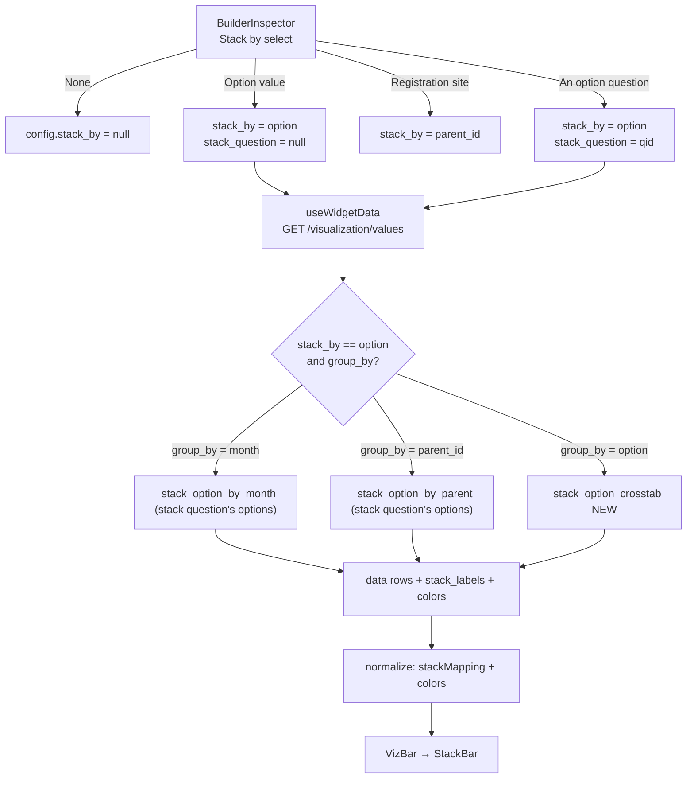

# [VIZ-015] Bar chart stacking by another question: design

**Status:** implemented on
`feature/349-viz-015-bar-chart-stacking-by-another-question` (GitHub
[#349]). 608 backend tests and 435 frontend tests across 49 suites pass;
flake8, eslint and prettier are clean.

This document supersedes the first draft of the same design, and has been
brought back in line with the code after implementation. Where the plan and
the build disagree, the build won and the reasoning is recorded in place —
see D-4, D-5 and D-6, which all came out of driving the real builder
against a real form family and are the largest departures from the original
plan. D-6 in particular was not in scope when this was written: fixing
Stack by made the identical defect in the control directly above it
impossible to leave alone.

## Problem

A bar chart can be stacked today, but only in two hard-wired ways: by the
options of *its own* question (`stack_by=option`) or by registration site
(`stack_by=parent_id`). The one thing an author actually asks for — "show
me water point functionality, split by management type" — cannot be
expressed at all. The two questions involved are different questions on the
same form, and no part of the grammar carries a second question id.

The gap is one field wide. Everything else already works: the values
endpoint returns per-stack columns, `stack_labels` and `colors`;
[`useWidgetData.js:270`](../../frontend/src/util/hooks/useWidgetData.js#L270)
turns `stack_labels` into a `stackMapping`; and
[`VizBar.jsx`](../../frontend/src/components/dashboard/widgets/VizBar.jsx)
swaps in akvo-charts' `StackBar` whenever `stack_by` is truthy. What is
missing is a way to say *which question* supplies the stacks, and one
handler for the cross-tab shape that produces.

## Acceptance criteria

### User Acceptance Criteria

Verbatim from the issue:

- [x] Bar chart "Stack by" offers the option-type questions of the selected
      form, in addition to the current None / Option value / Registration
      site choices — narrowed by D-5 to the groupings that actually draw a
      chart, and by D-4 to `Group by = Option value`.
      **Since S-13 that control is named `Break down by` on bar charts and
      the grouping is written by the choice rather than set beforehand.**
      The criterion is met either way: the same questions are offered and
      the same config is stored. `Stack by` survives under its own name on
      line and pie
- [x] Selecting another option question stacks each bar by that question's
      options
- [x] The legend shows the option labels of the stacking question
- [x] Only option / multiple option questions are offered as stacking
      questions

### Technical Acceptance Criteria

Each line is checkable without reading the slice it comes from. The slice
in brackets is where the work lives, not an extra condition.

**Grammar and validation**

- [x] `/visualization/values` accepts `stack_question_id`, valid only
      alongside `stack_by=option`; every other pairing is a 400 with its
      own message, never a silently ignored parameter [S-1]
- [x] The stack question is rejected unless it exists on `form_id` and its
      type is `option` or `multiple_option`; `number` and `date` are
      refused at the serializer, not at render time [S-1]
- [x] `stack_question_id == question_id` normalizes to `None` before it
      reaches the compute layer — one spelling of the self-stack, not two
      [S-1]
- [x] `option_value` combined with `stack_question_id` is a 400, not a
      silently unstacked chart — the `option_value` branch returns before
      the `stack_by` test is ever reached [S-1]
- [x] `validate_widget` rejects the same four conditions at save time, in
      wording parallel to the serializer's, so a config that saves always
      renders [S-3]
- [x] The stack question is validated against the widget's own form, so
      cross-form stacking is unreachable through either entry point
      [S-1, S-3]. See VIZ-015.a for why that turned out to be the wrong
      long-term rule — the useful direction has a working precedent.
- [x] A stack question requires `group_by=option`, refused at the
      serializer, at `validate_widget` and in the inspector (D-4)
      [S-1, S-3, S-4]

**Computation**

- [x] `group_by` ∈ {`month`, `date`, `parent_id`} with `stack_by=option`
      returns rows bucketed by the group and columns keyed by the
      question's option labels, over an unchanged submission set [S-2, S-9]
- [x] `group_by=option` returns the cross-tab: one row per option of the
      widget's question, one numeric column per option of the stack
      question [S-2]
- [x] The cross-tab costs two flat `Answers` queries over `data_ids` plus
      in-Python bucketing — no O(groups × options) query fan-out [S-2]
- [x] `value_type=percentage` normalizes within each bar; a bar whose total
      is 0 stays 0 rather than dividing by zero [S-2]
- [x] `value_type=percentage` with a `multiple_option` stack question
      divides by **distinct submissions in the bar**, not by the sum of its
      columns, so the chart states a fact about sites rather than about
      selections; a single-select stack question computes exactly as before
      (D-1) [S-2]
- [x] Cross-tab bars are ordered by total descending, ties broken on option
      `order`; segments and `stack_labels` stay in option `order`; month
      and date groupings stay chronological and `parent_id` keeps its
      existing (unordered) behaviour (D-2) [S-2]
- [x] A question is never cross-tabbed against itself: `group_by=option`
      with no distinct stack question falls through to the plain option
      breakdown rather than drawing a diagonal (D-4) [S-2]
- [x] A `multiple_option` stack question counts a submission into every
      option it selected [S-2]
- [x] Row keys and `stack_labels` agree exactly, including when two options
      share a label or an option is labelled `label`/`group`/`color` [S-2]
- [x] `stack_labels` and `colors` follow `QuestionOptions.order` [S-2]

**Builder UI**

- [x] The Stack by select offers only combinations the compute layer can
      draw, which depends on the QUESTION's type rather than the chart's
      (D-5) [S-4]:
      no question → `None` alone, and the control is disabled;
      option question → `None`, `Option value`, plus the form's other
      option questions **when `group_by=option`**;
      number question → `None`, `Registration site`, and only under
      `group_by` ∈ {`month`, `date`}
- [x] `Registration site` is never offered for an option question, and
      `Option value` never for a number question — the compute layer
      ignores both pairings and returns an unstacked or empty chart (D-5)
      [S-4]
- [x] Number- and date-typed questions never appear as stacking questions
      [S-4]
- [x] The question entries are offered for `bar` only; a `line` widget
      still gets the fixed choices its own question type allows [S-4]
- [x] Changing the question or the grouping clears a stack choice the new
      shape cannot draw, so the inspector cannot build an unsaveable
      config (`withValidStack`) [S-4]
- [x] Selecting a question writes `{stack_by: "option", stack_question:
      <id>}` in a **single** state update — not two `updateConfig` calls,
      whose stale closure would drop the first field [S-4]
- [x] The `q:<id>` prefix is UI-only: it is never stored in `config` and
      never sent to the API [S-4]
- [x] Changing the widget's form drops a now-foreign `stack_question`, and
      the widget still saves [S-4]
- [x] Stacked rows reach the chart as `label` plus exactly the
      `stack_labels` columns; `group` never survives, because akvo-charts
      makes a series of every key but the first (S-10) [S-10]
- [x] `stack_question_id` reaches the request only when set; `compact()`
      drops it otherwise [S-4]

**Rendering**

- [x] Stack segment colours come from the stack question's option colours,
      in `order`, and only when **every** option carries one; an empty,
      all-null or partly-null `colors` falls back to `widget.color` rather
      than emitting nulls into the palette. `QuestionOptions.color` is
      nullable and nothing defaults it, so the partly-null case is the
      normal one on author-built forms [S-5]
- [x] Under `measure=all_submissions`, a site whose registration is pending
      or draft is excluded from `stack_by=parent_id` and `group_by=parent_id`,
      so both measures agree on which sites exist (D-3) [S-7]
- [x] A public dashboard whose widget names a `stack_question` serves that
      widget to an anonymous caller — the id reaches `allowlist_from`'s
      `questions` set [S-8]
- [x] A published widget whose `stack_question` was deleted reports
      `is_broken` with reason `stack_question_deleted`, ordered after
      `form_deleted` and `question_deleted` [S-6]

**Compatibility and hygiene**

- [x] Every widget stored today omits `stack_question` and renders
      byte-identically; no migration, no snapshot rewrite, no version bump
- [x] Every existing test in `tests_values_stack.py` passes untouched
- [x] `./dc.sh exec backend flake8` clean; frontend eslint clean in the
      container per `frontend/.eslintrc.json`
- [x] The cross-tab response shape has an OpenAPI example in
      `dashboard_examples.py` — it is not guessable from the parameter list

## What exists today

| Layer | File | Behavior |
|---|---|---|
| Builder UI | [`builderConstants.js:107`](../../frontend/src/pages/dashboards/builderConstants.js#L107) | `VALID_STACK_BY` is a static three-entry list: `""`, `option`, `parent_id` |
| Builder UI | [`BuilderInspector.jsx:366`](../../frontend/src/pages/dashboards/BuilderInspector.jsx#L366) | One `Select`, writes `config.stack_by` and nothing else |
| Request | [`useWidgetData.js:174`](../../frontend/src/util/hooks/useWidgetData.js#L174) | Forwards `stack_by` to `/visualization/values` |
| Response shaping | [`useWidgetData.js:270`](../../frontend/src/util/hooks/useWidgetData.js#L270) | On `stack_by`, passes rows through unprojected and derives `stackMapping` from `stack_labels`. **Drops `response.colors`.** |
| Save validation | [`dashboard_functions.py:338`](../../backend/api/v1/v1_visualization/dashboard_functions.py#L338) | `stack_by` requires `group_by` + a question; value must be in `VALID_STACK_BY` |
| Query validation | [`dashboard_serializers.py:31`](../../backend/api/v1/v1_visualization/dashboard_serializers.py#L31) | `ChoiceField(VALID_STACK_BY)`, same two co-requisites |
| Compute | [`values_functions.py:362`](../../backend/api/v1/v1_visualization/values_functions.py#L362) | `handle_option_question` routes `stack_by == "option"` + `group_by` to `handle_stack_by_option` |
| Compute | [`values_functions.py:870`](../../backend/api/v1/v1_visualization/values_functions.py#L870) | Supports `group_by` ∈ {`month`, `parent_id`} only; anything else returns empty |
| Publish | [`dashboard_snapshot.py:39`](../../backend/api/v1/v1_visualization/dashboard_snapshot.py#L40) | `annotate_broken` checks `widget.form` and `widget.question` liveness — **nothing inside `config`** |

Two facts make the change small:

1. `_stack_option_by_month` and `_stack_option_by_parent` already take the
   question whose options become the stacks as an argument. They do not
   care whether it is the widget's own question. Passing a different one is
   the whole feature for `group_by` ∈ {`month`, `parent_id`}.
2. `/sources` already ships each question's `type` as a lowercase string
   and its options
   ([`dashboard_builder_serializers.py:104`](../../backend/api/v1/v1_visualization/dashboard_builder_serializers.py#L104)),
   so the picker needs no new endpoint and no new field.

The one genuinely new thing is `group_by=option` + a stack question: a
cross-tab of two questions' options, which no handler produces today.

## Design decision: how "stack by question X" is spelled

**Chosen: keep `stack_by="option"`, add an optional companion field naming
the question.**

- Widget config: `{"stack_by": "option", "stack_question": <question id>}`
- Query param: `stack_question_id=<id>`, alongside `stack_by=option`
- Absent / null `stack_question` means the widget's own question — exactly
  today's behavior, byte for byte.

Why this and not the alternatives:

- **`stack_by="question:{id}"` (compound string).** The first draft's
  choice, on the reasoning that one parameter keeps every reader from
  growing a second branch. That reasoning holds for the *compute* layer and
  fails for the *validation* layer, which is where the cost actually
  lands: it breaks every enum check in the stack — `ChoiceField`, the
  `VALID_STACK_BY` membership test at
  [`dashboard_functions.py:351`](../../backend/api/v1/v1_visualization/dashboard_functions.py#L351),
  and the OpenAPI `enum`. Three validators would each need a parser, and a
  compound id inside a stored config is invisible to any "which questions
  does this dashboard reference" query — which is not hypothetical:
  `allowlist_from` is exactly that query, and S-8 below reads a plain
  integer field where the compound form would need a fourth parser.
- **New `stack_by` value `"question"`.** Honest, but it forces a fourth
  branch through `handle_option_question` and makes today's
  `stack_by=option` mean "the implicit self case" rather than simply "stack
  by option values". The companion-field form collapses both into one path.
- **A second question id already has a precedent.** `date_question_id` is
  exactly this shape — a scalar mode plus an optional question that refines
  it. Following it keeps the grammar learnable.

Backward compatibility: every stored dashboard omits `stack_question`, so
every existing widget takes the unchanged path. No migration, no snapshot
rewrite, no version bump.



## Scope

Twelve slices. S-1 through S-4 are the feature; S-5, S-6 and S-8 are the
holes the feature opens if left alone; S-7 is a pre-existing defect D-3
turned up, in code this slice already edits. S-9 and S-10 were added during
implementation: the first because the plan's "leave `group_by=date`
returning nothing" was not survivable once the control was in front of a
user, the second because the first working stacked bar drew datapoint ids
as bars.

S-11 and S-12 were added later still, from a UI review and a bug report
against the running builder. S-11 is the widest change in this document:
it alters the inspector for every pie and every unstacked bar and line,
which the rest of the work does not touch, so it ships as its own commit.

S-7 is independent of all of them and ships in the same PR as its own
commit, because it is the only change here that moves numbers on an
already-published dashboard.

### S-1: Carry the stack question through the query grammar

The endpoint has to accept and validate a second question id before
anything can compute with one.

What to do:
- `ValuesFilterSerializer`
  ([`dashboard_serializers.py:17`](../../backend/api/v1/v1_visualization/dashboard_serializers.py#L17)):
  add `stack_question_id = serializers.IntegerField(required=False)`.
- In `validate()`, next to the existing `stack_by` co-requisite block
  ([:147](../../backend/api/v1/v1_visualization/dashboard_serializers.py#L147)):
  - `stack_question_id` without `stack_by` → 400, `"stack_question_id
    requires stack_by=option."`
  - `stack_by` other than `option` with a `stack_question_id` → same 400.
    `parent_id` stacks by site, not by options; silently ignoring the field
    would ship a chart that is not what the config says.
  - The question must exist on `form_id` → 400, reusing the wording of the
    existing `question_id` check.
  - Its type must be `option` or `multiple_option` → 400, `"stack question
    must be an option or multiple_option question."` Not
    `SUPPORTED_QUESTION_TYPES`: a number or date question has no option set
    to stack by, and would produce a chart with zero series.
  - `option_value` together with a `stack_question_id` → 400,
    `"option_value cannot be combined with stack_question_id."` This is not
    a taste call: `handle_option_question` tests `option_value` *before* it
    tests `stack_by`
    ([:346](../../backend/api/v1/v1_visualization/values_functions.py#L346)),
    so the pair silently returns an unstacked single-value count and throws
    the stacking away. A refusal is the only reading that cannot mislead.
  - Normalize `stack_question_id == question_id` to `None`. It is the
    self-stack the plain `stack_by=option` already means, and letting both
    spellings reach the compute layer doubles the shapes to test.
  - Resolve to a `Questions` instance in `data["stack_question"]`, mirroring
    how `data["question"]` is resolved.
- `dashboard_views.py`: add the `stack_question_id` `OpenApiParameter`
  (INT, optional, described as "Option question supplying the stacks; only
  with `stack_by=option`") and thread `"stack_question"` into the `params`
  dict built at
  [:176](../../backend/api/v1/v1_visualization/dashboard_views.py#L176).

Done when:
- `GET /visualization/values?...&stack_by=option&stack_question_id=<other
  option qid>` returns 200 and is *not* yet different from before (S-2
  makes it different).
- Each of the six rejection cases returns 400 with its own message, each
  covered by a test in `tests_values_errors.py`.
- Omitting `stack_question_id` produces a byte-identical response to the
  current build for every case in `tests_values_stack.py`.

### S-2: Stack by the other question's options

What to do:
- `handle_option_question`
  ([:327](../../backend/api/v1/v1_visualization/values_functions.py#L327)):
  read `params.get("stack_question")`. When present, load *its* options
  (`QuestionOptions.objects.filter(question=stack_question).order_by("order")`)
  and pass that question + those options into `handle_stack_by_option`
  instead of the widget's own. Same `data_ids`, same `qs`, same
  `is_latest` — the filtered submission set does not change, only which
  answer column is counted.
- `handle_stack_by_option`
  ([:870](../../backend/api/v1/v1_visualization/values_functions.py#L870)):
  its `month` and `parent_id` branches need no change beyond receiving the
  substituted question. Add the third branch: `group_by == "option"` →
  `_stack_option_crosstab(...)`.
- New `_stack_option_crosstab(question, options, stack_question,
  stack_options, data_ids, value_type)`: one row per option of the
  **widget's** question, one numeric column per option of the **stack**
  question.
  - Two `Answers` queries, both `values_list("data_id", "options")` over
    `data_ids` — one per question — then bucket in Python. Same shape as
    `_stack_option_by_month`, which already avoids the
    O(groups × options) query fan-out; do not reintroduce it here.
  - A `data_id` with no answer to the stack question contributes to no
    column (see "Behavior notes").
  - `value_type == "percentage"`: normalize within each bar, as
    `_stack_option_by_month` does — the row sums to 100, not the chart —
    except that the denominator follows D-1: distinct submissions in the
    bar when the stack question is `multiple_option`, sum of columns
    otherwise.
  - Sort the rows by their total, descending, ties broken on option
    `order` (D-2). Segment order is untouched — it stays option `order`,
    which is what `stack_labels` and `colors` already carry.
  - Return `{"data", "labels", "stack_labels", "colors"}`, `stack_labels`
    and `colors` from the stack question's options in `order`.
- Apply the D-1 denominator in `_stack_option_by_month` too, where the
  same divergence exists today. `_stack_option_by_parent` has no percentage
  branch at all, so nothing to change there. Gate it on the stack
  question's type so single-select charts compute exactly as before.
- Guard the row keys. Rows are keyed by option *label*, so a stack option
  literally labelled `label`, `group` or `color` would overwrite a
  structural key, and two options sharing a label would silently merge.
  Suffix a duplicate or reserved label (`"Other (2)"`) when building
  `stack_labels`, and key the row with the same suffixed string so the
  legend and the columns cannot disagree. This bug exists today for
  `stack_by=option`; fixing it here fixes it there too, since both go
  through the same builder.
- Leave `handle_number_question`
  ([:653](../../backend/api/v1/v1_visualization/values_functions.py#L653))
  alone. See "Out of scope".

Done when:
- New `tests_values_stack.py` cases, on the existing mixin fixture
  (`operational_status` × `features`):
  - `group_by=month&stack_by=option&stack_question_id=<features qid>` —
    columns are feature labels, months are rows.
  - `group_by=parent_id&…` — one row per site.
  - `group_by=option&…` — the cross-tab: rows are `operational_status`
    labels, columns are `features` labels, and the grand total matches a
    hand-counted expectation.
  - `value_type=percentage` on the cross-tab: every row sums to 100 (±0.01
    for rounding), and a row whose bar total is 0 stays 0 rather than
    dividing by zero.
  - A `multiple_option` stack question: a submission selecting two options
    lands in both columns.
  - Duplicate stack labels are disambiguated and `stack_labels` matches the
    row keys exactly.
  - `value_type=percentage` with a `multiple_option` stack question divides
    by distinct submissions: a bar of 10 sites where 6 have a handpump
    reports 60, not handpumps-over-total-selections, and the row may exceed
    100.
  - The cross-tab's rows come back ordered by total descending, with two
    equal totals falling back to option `order`; `stack_labels` is still in
    option `order`.
  - A `group_by=month` chart is still chronological — the D-2 sort does not
    leak into the time paths.
- Every existing test in `tests_values_stack.py` passes untouched.
- `./dc.sh exec backend flake8` clean.

### S-3: Accept the field at save time

An author cannot save what `validate_widget` refuses, and a config that
saves but 400s on render is worse than one that never saved.

What to do:
- `dashboard_functions.py`, in the widget config validation around
  [:338](../../backend/api/v1/v1_visualization/dashboard_functions.py#L338):
  - `config.stack_question` present without `config.stack_by` →
    `"stack_question requires stack_by"`, field `config.stack_question`.
  - With `stack_by` other than `"option"` → `"stack_question requires
    stack_by=option"`.
  - The question must be in the already-fetched `questions` queryset and
    on the widget's form → `"stack question must belong to the widget's
    form"`. This mirrors the existing `question` check and reuses its
    queryset; do not add a second query.
  - Type must be `option`/`multiple_option` → `"stack question must be an
    option or multiple_option question"`.
- Keep the messages parallel to the serializer's. Two layers rejecting the
  same config with two different sentences is how a support ticket becomes
  a bug hunt.

Done when:
- `tests_dashboard_validation.py` covers each rejection, and the valid
  payload round-trips through `PUT` → `GET` with `stack_question` intact.
- A widget with `stack_by=option` and no `stack_question` still saves.

### S-4: Offer the questions in the inspector

What to do:
- `builderConstants.js`: add `stackByOptions(questions, widgetQuestionId,
  groupBy)` beside `VALID_STACK_BY`, in the style of the existing
  `tableColumnOptions`. The plan's version simply appended every option
  question to the fixed three; D-5 replaced it with a function of the
  question's type *and* the grouping, because the fixed three were
  themselves wrong for half the question types. It returns `None` alone
  when there is nothing drawable, which is what disables the control.

  The `q:` prefix is a **UI-only** encoding for the `Select`'s scalar
  `value`; it is unwrapped on change and never stored or sent. Excluding
  the widget's own question keeps the list honest — that entry is already
  spelled "Option value".
- Offer the extended list for `bar` only, and be honest about why. It is a
  product decision, not a technical limit: `/values` never sees the widget
  type, so what happens is decided by the **question** type, not the chart
  type. A line widget bound to an *option* question would route through
  `handle_option_question` exactly as a bar does, and `VizLine` already
  swaps in `StackLine` on the same `Boolean(config.stack_by)` test — it
  would simply work. Only a line on a *number* question goes through
  `handle_stack_by_parent`, which this slice does not touch. The UAC names
  bar, so gate on `wType === "bar"` rather than on `NEEDS_STACK_BY`, and
  widening later is a one-line change with tests already in place.
- `BuilderInspector.jsx:363-378`: derive the select's value from both
  fields and write both on change.

  ```js
  const stackValue = wConfig.stack_question
    ? `q:${wConfig.stack_question}`
    : wConfig.stack_by || "";

  const onStackChange = (val) => {
    const qid = val.startsWith("q:") ? Number(val.slice(2)) : null;
    onWidgetChange({
      ...widget,
      config: {
        ...widget.config,
        stack_by: qid ? "option" : val || null,
        stack_question: qid,
      },
    });
  };
  ```

  Note this must go through `onWidgetChange` directly rather than two
  `updateConfig` calls — `updateConfig` closes over `widget`, so a second
  call in the same tick would overwrite the first's field with the stale
  value. That is the bug this shape exists to avoid.
- Clear `stack_question` when the widget's form or question changes. The
  form picker already calls `pruneConfigForForm`; extend it to drop
  `stack_question` when the id is not in the new form's questions — the
  function currently only prunes the `columns` and `criteria` arrays. On a
  question change, clear `stack_question` if it now equals the new
  `widget.question` (the entry is no longer offered).
- `useWidgetData.js:174`: add `stack_question_id: config.stack_question` to
  the `compact(...)` params. `compact` drops the null, so unstacked and
  self-stacked widgets send nothing new.

Done when:
- With a form carrying two option questions, the Stack by select lists
  None / Option value / Registration site / both question labels, minus
  whichever is the widget's own question.
- A number-typed and a date-typed question are absent from the list.
- Selecting a question writes `{stack_by: "option", stack_question: <id>}`
  in one state update; selecting None writes `{stack_by: null,
  stack_question: null}`.
- Switching the widget's form drops a now-foreign `stack_question`, and
  the widget still saves.
- A line widget's select still shows exactly three entries.
- `./dc.sh exec -T frontend npx eslint src/pages/dashboards src/util/hooks/useWidgetData.js` clean
  (`curly`, `no-undefined`, `prefer-arrow-callback`, prettier).
- Frontend tests: `builderConstants` unit tests for `stackByOptions`, an
  inspector test for the two-field write, and a `useWidgetData` test that
  `stack_question_id` reaches the request.

### S-5: Colour the stacks from the question's options

The UAC asks for the stacking question's labels in the legend. The labels
already arrive; the colours are thrown away, so a five-option stack renders
in akvo-charts' default cycle with no relation to how the same options are
coloured on every other chart in the dashboard.

`QuestionOptions.color` is the source, and it is
`TextField(default=None, null=True)`
([models.py:214](../../backend/api/v1/v1_forms/models.py#L214)). Nothing
fills it in: every creation path writes `color=opt.get("color")` verbatim
([functions.py:206](../../backend/api/v1/v1_forms/functions.py#L206),
[:445](../../backend/api/v1/v1_forms/functions.py#L445),
[:589](../../backend/api/v1/v1_forms/functions.py#L589)), and there is no
fallback palette anywhere in the backend. `example-vis-6` has colours
because its seed JSON spells them out; a form authored in the form builder
or imported from XLSForm typically has `NULL` on every option, and a
part-way-coloured question is entirely possible.

So `colors` may arrive as `[]`, as `[null, null, null]`, or — the nasty one
— as `["#64A73B", null, null]`.

What to do:
- `useWidgetData.js:270`, the `config.stack_by` branch of `normalize`:
  return `color: response.colors` alongside the existing `data` and
  `extraConfig`, but **only when every entry is a non-empty string**.
  `renderWidget` already merges a top-level `color` array, and `VizBar`
  already passes an array straight through.
- All-or-nothing, deliberately. A partly-null array is worse than no array:
  akvo-charts reads it as a palette, so the coloured series keep their
  authored colour while the null ones fall to whatever the library does
  with a null — at best an unrelated default, at worst a colour already
  used by another series in the same bar. Dropping the array entirely gives
  every series a distinct auto colour, which is the readable failure.
- Fix the same bug one line down, in the non-stacked branch
  ([:325](../../frontend/src/util/hooks/useWidgetData.js#L325)): it gates on
  `rows.some((row) => row.color)` and then maps *all* rows, so a question
  with one coloured option today emits nulls for the rest. `some` → `every`.
  Same predicate, same reasoning, and it is the shared point both paths
  route through — patching only the stacked path would leave the sibling
  broken.
- Nothing on the backend. It has returned `colors` from the start
  ([`values_functions.py:1035`](../../backend/api/v1/v1_visualization/values_functions.py#L1035));
  the nulls are faithful reporting of what the form says.

Done when:
- A stacked bar's segment colours equal the stack question's
  `QuestionOptions.color` values, in `order`, when every option has one.
- `colors: []`, `colors: [null, null, null]` and
  `colors: ["#64A73B", null, null]` all fall back to `widget.color` — the
  third is the case worth its own test, because it is the one that looks
  like it should work.
- An unstacked widget's `color` handling is unchanged for fully-coloured
  questions (the existing "without `group_by=option` the widget colour is
  left alone" test still passes), and a partly-coloured question now falls
  back instead of emitting nulls.

### S-6: Notice when the stack question is deleted

`annotate_broken`
([`dashboard_snapshot.py:39`](../../backend/api/v1/v1_visualization/dashboard_snapshot.py#L40))
checks `widget.form` and `widget.question`. A `stack_question` deleted after
publish is not checked, so the published dashboard keeps rendering and the
viewer gets a 400 from the values endpoint with no explanation — the one
failure mode this function exists to prevent.

What to do:
- Include `config.stack_question` ids in the `live(Questions, ...)` id set.
  The helper takes a top-level key; either generalize it to a value
  extractor or collect the config ids in a second pass — one extra query
  at most, still flat in widget count.
- Add a `stack_question_deleted` reason, ordered after `form_deleted` and
  `question_deleted` for the same reason those are ordered: a widget on a
  deleted form must not blame a question that went down with it.

Done when:
- `tests_dashboard_snapshot.py` covers a published widget whose
  `stack_question` was soft-deleted: `is_broken` is true and
  `broken_reason` is `stack_question_deleted`.
- Deleting the widget's own question still reports `question_deleted`, and
  a deleted form still wins over both.
- The viewer renders the existing broken-widget placeholder, unchanged.

### S-7: exclude pending and draft parents on the `all_submissions` path

Per D-3. Pre-existing, unrelated to stacking by another question, and in
scope only because this slice is already inside both functions.

What to do:
- `_stack_option_by_parent`
  ([:999](../../backend/api/v1/v1_visualization/values_functions.py#L999)):
  add `is_pending=False, is_draft=False` to the
  `FormData.objects.filter(id__in=parent_ids)` call.
- `handle_stack_by_parent`
  ([:1058](../../backend/api/v1/v1_visualization/values_functions.py#L1058)):
  the same two kwargs on `parent_data`.
- Nothing else. The `current_state` path is already correct, and the
  registration-form path inherits its filters from `qs`.
- Ship it in this PR, in its own commit, and name it in the PR description.
  It changes numbers on dashboards that are already published, so it must
  read as its own diff and revert without taking the feature with it.

Done when:
- A fixture with an approved monitoring submission under a **pending**
  registration: that site is absent from `stack_by=parent_id` and from
  `group_by=parent_id` under `measure=all_submissions`, and was already
  absent under `current_state`. The two measures now agree on which sites
  exist.
- The same for a **draft** registration parent.
- Sites whose parent is approved are unaffected — every existing
  `tests_values_stack.py` and `tests_values_option.py` case passes
  untouched.

### S-8: let a public dashboard query the stack question

`allowlist_from` bounds what an anonymous caller may ask a public dashboard
about, by collecting the ids the published snapshot names
([public_scope.py:52](../../backend/api/v1/v1_visualization/public_scope.py#L52)).
It already walks `widget.question`, `config.question_y`, and the `question`
key inside `config.criteria` and `config.columns` — but it cannot know
about `config.stack_question`. A public dashboard carrying a
stacked-by-another-question bar would therefore refuse to serve its own
widget.

What to do:
- In the per-widget loop, collect
  `_as_id(widget_config.get("stack_question"))` into `questions`, beside
  the `question_y` line it most resembles.
- Use `_as_id` rather than trusting the value: the function deliberately
  degrades a malformed id into a narrower allowlist instead of a crash on
  every public view, and this key inherits that contract.

Done when:
- `tests_public_scope.py` covers a snapshot whose only question reference is
  a `config.stack_question`, and the resulting allowlist permits it.
- An anonymous caller can render a published public dashboard containing
  the S-4 widget end to end.

### S-9: stack a chart grouped by date

The plan left `group_by=date` returning an empty chart, on the reasoning
that per-day stacking is not a chart anyone asked for and the emptiness was
pre-existing. That did not survive contact with the builder: `Date` sits in
the Group by list, so picking it with any stack silently produced "No data"
and read as a broken feature rather than an unsupported combination.

What to do:
- Generalise `_stack_option_by_month` into `_stack_option_by_period(...,
  period="month"|"date")`. The two differ only in bucket width — 7 leading
  characters of an ISO date is its month, 10 is its day — so the branch is
  a parameter, not a second copy of the function. The `date_question_id`
  path narrows its `Substr` accordingly; the created-date path swaps
  `TruncMonth` for `data__created__date`.
- Route `group_by in ("month", "date")` to it from `handle_stack_by_option`.

Done when:
- `group_by=date&stack_by=option` returns one row per day, chronological,
  with the option labels as columns — asserted on the mixin fixture's four
  submission dates.

### S-10: stop plotting `group` as a series

The first working stacked bar drew two enormous bars next to the real
stacks. They were datapoint ids: akvo-charts builds its series from the
row's object keys and drops only the first (`dimensions.slice(1)` in its
`StackBar`), so the `group` key the server sends became a plotted series —
named `group` in the legend, and on the parent path carrying `parent.id` as
its value. A chart of counts under 5 grew bars in the thousands.

This predates VIZ-015: `_stack_option_by_parent` has always emitted
`group`, so `stack_by=option` + `group_by=parent_id` has been wrong for as
long as it has existed. Stacking by another question is simply the first
feature that made anyone look at it.

What to do:
- In `normalize`'s `config.stack_by` branch, project each row to `label`
  first — akvo-charts reads the first key as the category axis — followed
  by exactly the `stack_labels` columns, defaulting a missing column to 0.
- Do **not** widen this to a general "drop unknown keys": the projection is
  positive rather than negative on purpose, so a future response key cannot
  silently become a bar.

Done when:
- A response carrying `group` renders only its stack columns, asserted in
  `useWidgetData.test.js`.
- A row missing one of the `stack_labels` columns renders it as 0 rather
  than as a hole.

### S-11: Group by offers only what draws, and hides when that is one

> **Superseded for bar charts by S-13.** This treated the symptom — a
> control that had to hide itself half the time is a control that was never
> separate — and S-13 removes the pair for bar. It is kept in full because
> its truth table is what the merged list is built from, and because line
> and pie still run this code.

Not planned. Fixing the Stack by list (D-5) left the identical defect in
the control directly above it, and a UI review asked why `Group by` existed
at all for an option question.

Measured against the compute layer, for the most common widget on the board
— an unstacked option question — exactly one of the four choices returns
any rows:

| Question | Stack | `group_by` that draw |
|---|---|---|
| option, unstacked | — | `option` only; month, date and parent_id return **0 rows** |
| option, self-stacked | `option` | month, date, parent_id — **not** `option`, which is the diagonal D-4 refuses |
| option, stacked by another question | `option` + `stack_question` | `option` only, because that is the cross-tab (D-4) |
| number | — | month, date, parent_id; `option` collapses to one "Total" bar |
| number, stacked by site | `parent_id` | month, date only |
| none, or a date question | — | month, date, parent_id |

What to do:
- `groupByOptions(question, config)` in `builderConstants.js`, beside
  `stackByOptions` and shaped the same way. It takes the whole config
  rather than one field because three keys decide the answer:
  `stack_by`, `stack_question` and `stack_form`.
- Hide the control when that leaves one value **and** the stored value is
  already it. Still show it when the stored value is something else, so a
  widget saved with a grouping that draws nothing stays repairable — one
  click, and then it hides. Nothing is rewritten behind the author's back.
- `withValidGroupBy(config, choices)` snaps a stranded grouping to the
  first that draws. Run it when the question changes **and** when the stack
  changes, in that order: the stack decides what the bars may be, so the
  grouping is validated against the stack that just arrived rather than the
  one being replaced.

Done when:
- An unstacked option question shows no Group by at all.
- Selecting a self-stack makes it appear with month / date / site.
- A number question never sees `This question's options`.
- A saved widget whose grouping draws nothing still offers the repair.

The truth table above survives the merge intact — it is exactly what
`breakdownOptions` returns, read the other way round. Where this section
asks "given the stack, which groupings draw", S-13 asks "given the
question, which second dimensions draw", and the same six rows answer
both.

### S-12: trust the response shape, not the config

`normalize` branched on `config.stack_by`, which says what the author asked
for rather than what the server returned. The two disagree in exactly one
place, and D-4 created it: asked to cross-tab a question against itself the
backend declines the diagonal and answers with the plain option breakdown,
which carries no `stack_labels` at all.

The stacked branch then projected eight rows of real counts down to bare
labels and drew an empty chart with a single axis line — reported from the
running builder, and invisible to every test that mocked a stacked
response.

What to do:
- Gate the branch on `config.stack_by` **and** a non-empty `stack_labels`
  on whichever response supplies the legend. When the server answers
  unstacked, take the unstacked path.

Done when:
- A response with rows but no `stack_labels` renders its `{label, value}`
  rows, asserted in `useWidgetData.test.js`.

### S-13: one "Break down by" for bar, replacing Group by and Stack by

S-11 hid Group by whenever the stack left it one value, which treated the
symptom: the two controls were one idea split in half, and neither could
be read without the other. Two things proved it. Cross-form questions
appeared only *after* Group by was already `Registration site`, which is
why `crossFormWithheld` had to exist to explain their absence. And "Stack
by: Registration site" on a number question drew an empty chart — the bug
that prompted this — because the pairing was legal but the projection
below (S-10) assumed a category key those handlers do not use.

Bar charts now have a single list of *the other dimension*: the axis when
that is a time or a site, the segments when it is another question.

| Choice | `group_by` | `stack_by` | ids |
|---|---|---|---|
| None — this question's options | `option` | — | — |
| Month / Date | `month` / `date` | `option` | — |
| Registration site | `parent_id` | `option` | — |
| Another question | `option` | `option` | `stack_question` |
| Another form's question | `parent_id` | `option` | `stack_form` + `stack_question` |

A number question has no options of its own, so it drops the `None` row
and never stacks; its three entries write `group_by` alone.

**And it is offered no question entries at all**, which reads as a gap and
is not one. `handle_number_question` routes on `group_by` and `stack_by`
alone, and `stack_question_id` is refused unless the measured question is
option-typed — there is nothing for a second question's options to
cross-tab against. The chart an author is reaching for there ("average
project cost by agency") is VIZ-015.b's, with the roles swapped: the
option question becomes the **Question** and the number becomes the
**Value**. That spelling also reaches combinations the numeric side cannot
— cost over time split by agency is Question = agency, Break down by =
Month, Value = cost.

The control says so rather than leaving the author to infer it: with a
number question selected, the hint names the swap instead of promising
"the segments for another question" while offering none.

**Bar only.** A line chart's request path fixes `group_by=month` and
discards the control's value, and it has its own X axis and Category
controls (VIZ-013); a pie has no stack to merge with. `groupByOptions`,
`stackByOptions` and their validators stay for those two — this adds a
control rather than replacing the pair everywhere.

**Stored config is unchanged.** The merged control writes the same four
fields, so no published dashboard needs migrating and the backend never
learns the merge happened. A widget saved with a combination the list no
longer offers still renders; `withValidBreakdown` only snaps it when the
measured question changes underneath it.

**The category key.** S-10 projects each row to `label` plus the stack
columns. `_stack_parent_by_month` and `_stack_parent_by_date` key their
rows `month`/`date` instead, which went unnoticed while the branch passed
rows through whole — akvo-charts reads whatever the first key is. The
projection is what made the name matter, and hardcoding `label` drew a
chart of `undefined` categories. `normalize` now reads
`label ?? month ?? date`.

## Worked example: the config and the payloads it produces

Everything below is hand-derived from the existing
`VisualizationValuesTestMixin` fixture (`example-vis-6`,
[`mixins.py`](../../backend/api/v1/v1_visualization/tests/mixins.py)). No
container was run to produce it; it is the expectation the S-2 tests assert
against, so a mismatch is a bug in the implementation or in this table, and
either is worth knowing.

### The fixture

Monitoring form `6002`, four submissions under two registration sites:

| Submission | Site | Created | `operational_status` (600203) | `features` (600204) |
|---|---|---|---|---|
| mon1a | Site Alpha (7200) | 2025-01-15 | `active` | `feature_x`, `feature_y` |
| mon1b | Site Alpha | 2025-03-10 | `active` | `feature_y`, `feature_z` |
| mon2a | Site Beta (7201) | 2025-01-20 | `inactive` | `feature_x`, `feature_z` |
| mon2b | Site Beta | 2025-03-15 | `pending` | `feature_x`, `feature_y`, `feature_z` |

Option metadata, straight from
[`example-vis-6.monitoring.json`](../../backend/source/forms/example-vis-6.monitoring.json):

- `operational_status` (`option`): `active`/Active/`#64A73B`,
  `inactive`/Inactive/`#e41a1c`, `pending`/Pending/`#ff7f00`
- `features` (`multiple_option`): `feature_x`/Feature X/`#1f77b4`,
  `feature_y`/Feature Y/`#ff7f0e`, `feature_z`/Feature Z/`#2ca02c`

### The widget config

"Operational status, each bar split by the features present" — the
cross-tab, and the case the UAC is really about:

```json
{
  "id": 42,
  "order": 1,
  "type": "bar",
  "col_span": 12,
  "title": "Operational status by feature",
  "color": "#1890ff",
  "form": 6002,
  "question": 600203,
  "config": {
    "measure": "all_submissions",
    "group_by": "option",
    "stack_by": "option",
    "stack_question": 600204,
    "value_type": "number",
    "orientation": "vertical"
  }
}
```

`stack_by` stays `"option"`; `stack_question` is the whole addition. Drop
that one key and this is a valid widget today, which is the point of the
spelling chosen above.

`useWidgetData` turns it into:

```
GET /api/v1/visualization/values
  ?form_id=6002
  &question_id=600203
  &monitoring=all
  &group_by=option
  &stack_by=option
  &stack_question_id=600204
  &value_type=number
```

### Expected response — A: `group_by=option` (the cross-tab)

Bars are `operational_status` options, columns are `features` options.
Active holds mon1a + mon1b, Pending holds mon2b, Inactive holds mon2a:

```json
{
  "data": [
    {"group": "active",   "label": "Active",   "Feature X": 1, "Feature Y": 2, "Feature Z": 1},
    {"group": "pending",  "label": "Pending",  "Feature X": 1, "Feature Y": 1, "Feature Z": 1},
    {"group": "inactive", "label": "Inactive", "Feature X": 1, "Feature Y": 0, "Feature Z": 1}
  ],
  "labels": ["Active", "Pending", "Inactive"],
  "stack_labels": ["Feature X", "Feature Y", "Feature Z"],
  "colors": ["#1f77b4", "#ff7f0e", "#2ca02c"]
}
```

Two D-2 behaviors are visible in that literal and both are asserted:
rows are ordered by total descending — Active 4, Pending 3, Inactive 2, not
option order — while `stack_labels` and `colors` stay in the stack
question's own option order. `Feature Y: 0` is present rather than omitted;
a missing key and a zero are the same picture but not the same JSON, and
akvo-charts derives series from keys.

### Expected response — B: same widget, `value_type=percentage`

This is the D-1 case made concrete. The Active bar holds **two**
submissions, which between them mention **four** features:

| | Feature X | Feature Y | Feature Z | Row sums to |
|---|---|---|---|---|
| Sum-of-columns denominator (today's rule) | 25 | 50 | 25 | 100 |
| **Distinct submissions (D-1)** | **50** | **100** | **50** | **200** |

The first row says "Feature X is 25% of the features mentioned on active
sites" — a sentence nobody wants, which reads exactly like the sentence
they do want. The second says "50% of active submissions reported Feature
X", which is true and useful, and sums past 100 precisely because one
submission belongs to several stacks.

```json
{
  "data": [
    {"group": "active",   "label": "Active",   "Feature X": 50.0,  "Feature Y": 100.0, "Feature Z": 50.0},
    {"group": "pending",  "label": "Pending",  "Feature X": 100.0, "Feature Y": 100.0, "Feature Z": 100.0},
    {"group": "inactive", "label": "Inactive", "Feature X": 100.0, "Feature Y": 0.0,   "Feature Z": 100.0}
  ],
  "labels": ["Active", "Pending", "Inactive"],
  "stack_labels": ["Feature X", "Feature Y", "Feature Z"],
  "colors": ["#1f77b4", "#ff7f0e", "#2ca02c"]
}
```

Bar order is unchanged: D-2 sorts on the underlying totals, not on the
normalized values, so switching to percentage must not reshuffle the bars.

### Expected response — C: `group_by=month` (refused since D-4)

`config.group_by` becomes `"month"`; nothing else changes. Jan holds mon1a
+ mon2a, Mar holds mon1b + mon2b:

```json
{
  "data": [
    {"group": "2025-01", "label": "Jan 2025", "Feature X": 2, "Feature Y": 1, "Feature Z": 1},
    {"group": "2025-03", "label": "Mar 2025", "Feature X": 1, "Feature Y": 2, "Feature Z": 2}
  ],
  "labels": ["Jan 2025", "Mar 2025"],
  "stack_labels": ["Feature X", "Feature Y", "Feature Z"],
  "colors": ["#1f77b4", "#ff7f0e", "#2ca02c"]
}
```

Chronological, not sorted by total — D-2 does not reach the time paths.

### Expected response — D: `group_by=parent_id` (refused since D-4)

Latest submission per site only: Site Alpha's mon1b (`feature_y`,
`feature_z`), Site Beta's mon2b (all three).

```json
{
  "data": [
    {"group": 7200, "label": "Site Alpha", "Feature X": 0, "Feature Y": 1, "Feature Z": 1},
    {"group": 7201, "label": "Site Beta",  "Feature X": 1, "Feature Y": 1, "Feature Z": 1}
  ],
  "labels": ["Site Alpha", "Site Beta"],
  "stack_labels": ["Feature X", "Feature Y", "Feature Z"],
  "colors": ["#1f77b4", "#ff7f0e", "#2ca02c"]
}
```

`group` is the parent's integer id here, not a string — that is what
`_stack_option_by_parent` already emits
([:1021](../../backend/api/v1/v1_visualization/values_functions.py#L1021)),
and it must not be "tidied" into a string while adding the stack question.

Row order is whatever the database returns: `_stack_option_by_parent`
issues no `order_by`, and `FormData.Meta` sets only `db_table`. It happens
to come out id-ordered, which happens to be alphabetical in this fixture.
The test must assert with an order-insensitive comparison, or it will pass
for the wrong reason.

### What is *not* in these payloads — and what became of it

Examples C and D were written when a stack question was allowed under any
grouping. In both, the widget's own question (600203) contributes nothing
to a single number: once the stacks come from another question and the bars
come from a month or a site, `operational_status` is only routing.

The plan called that "not worth a UI change in this slice". D-4 reversed
it. A control that looks load-bearing and is not is a bug in the interface
even when the numbers are right, and the same chart was already reachable
the honest way — by measuring the stacking question directly. So examples C
and D are now **400s**, not payloads: a stack question requires
`group_by=option`. They are kept here because they document what the
combination *would* have drawn, which is what makes the refusal make
sense.

Examples A and B are unchanged and are what ships.

## Behavior notes

These are consequences of the design, not defects to fix in this slice.
Each is worth stating because each one will otherwise be reported as a bug.

- **Bars shrink when stacking is turned on.** A submission with no answer
  to the stack question belongs to no stack and therefore drops out of the
  chart. The same chart unstacked counts it. This already happens for
  `stack_by=option`; it becomes far more visible when the stack question is
  a different, more sparsely answered one. `_option_group_by_option`
  already has the machinery for the honest version — an
  `include_unanswered` flag and a grey `"No information available"` bucket
  ([:560](../../backend/api/v1/v1_visualization/values_functions.py#L560))
  — so the follow-up is small and deliberately not bundled here.
- **A `multiple_option` stack question over-counts.** A submission
  selecting three options adds one to three columns, so in `number` mode
  the bar's segments sum to more than the number of submissions. That is
  inherent to stacking a multi-select and matches today's `stack_by=option`
  behavior; offering these questions is an explicit UAC requirement. In
  `percentage` mode it is *not* left alone — see D-1, which changes the
  denominator so the chart states a fact about sites rather than about
  selections.
- ~~**`group_by=date` with a stack question renders empty**~~ — fixed by
  S-9. The plan deferred it; the builder made it indefensible, because
  `Date` is in the Group by list and picking it produced "No data" with no
  explanation. Struck through rather than deleted: the reasoning for
  deferring it was wrong in an instructive way — "pre-existing and
  unasked-for" is not a defence once a control offers the combination.
- **`option_value` wins over stacking, so the pair is refused.**
  `handle_option_question` returns from its `option_value` branches before
  it ever reaches the `stack_by` test, so a config carrying both would draw
  an unstacked single-value count and drop the stacking without a word.
  S-1 rejects the combination rather than documenting a precedence nobody
  would expect. The inspector cannot currently produce the pair — the
  "Count records where" control is KPI-only — but the API can, and a
  hand-edited or AI-generated config is exactly where it would surface.
- **Legend labels are not translated.** `stack_labels` comes from
  `QuestionOptions.label`, never from `QuestionOptions.translations`, so a
  stacked chart's legend stays in the form's default language whatever the
  viewer's. This is not new — every existing `stack_by=option` chart and
  every `group_by=option` chart behaves the same way — and fixing it is a
  visualization-wide change, not a stacking one. Stated here only so it is
  not mistaken for a regression introduced by the stack question.
- **Long option labels are thinned on a vertical axis.** echarts' category
  axis defaults to `axisLabel.interval: "auto"`, which drops labels that
  would collide, so a bar chart with eight long option names shows roughly
  every third one. The bars and values are correct; only the labels are
  hidden. akvo-charts offers no way through — `transformConfig` builds the
  axis from a fixed set of named parameters and never spreads the caller's
  config, and its only escape hatch, `rawConfig`, replaces the entire
  option rather than merging into it. The workaround is
  `Orientation: Horizontal`, where each bar has its own row; it is what
  the production chart this feature replicates uses. Pre-existing for any
  long-labelled chart, but far more visible now that option labels are
  routinely the category axis. Fixing it properly is an upstream
  akvo-charts change to pass `axisLabel` through.
- **Cross-tab cost.** Two flat queries over `data_ids` plus in-Python
  bucketing. The bucket count is `|options| × |stack options|`, both of
  which come from `QuestionOptions` and are small by construction. No new
  index needed.

## Test plan

| Layer | File | What |
|---|---|---|
| Backend compute | `tests_values_stack.py` | The S-2 cross-tab cases, D-1's denominator, D-2's ordering, S-9's stacked dates, D-4's self-cross-tab fall-through |
| Backend compute | `tests_values_stack.py` | S-7 pending/draft parent exclusion, and that both measures now agree on which sites exist |
| Backend validation | `tests_values_errors.py` | The S-1 rejections, D-4's grouping rule, and that naming your own question is never rejected |
| Backend save | `tests_dashboard_validation.py` | The S-3 rejections including D-4's, plus the round-trip |
| Backend publish | `tests_dashboard_snapshot.py` | S-6 broken-reason precedence over form and question |
| Backend public | `tests_public_scope.py` | S-8 `stack_question` reaches the allowlist, and a malformed one narrows rather than crashes |
| Frontend units | `pages/dashboards/__test__/` | D-5's whole table, one case per row; `withValidStack`; form-change pruning |
| Frontend hook | `util/__test__/useWidgetData.test.js` | `stack_question_id` in params; S-5's three colour shapes; S-10's projection |

Actually run, in the container:

```
./dc.sh exec backend python manage.py test api.v1.v1_visualization --parallel 4   # 517 passed
./dc.sh exec backend flake8                                                        # clean
CI=true npx react-scripts test --watchAll=false                                    # 46 suites, 373 passed
npm run lint && npx prettier --check src                                           # clean
```

Two frontend suites were failing on this branch before any of this work —
`DashboardViewer` (4) and `noEchartsInViewer` (1) — from #362's reworded
copy and #364's direct echarts import. Proven pre-existing by stashing the
whole change set and re-running. Fixed alongside, since a red suite hides
the next real failure; the echarts one is recorded as a named exception
rather than silenced, because it is a live D-10 violation and not a stale
assertion.

An OpenAPI example belongs in `dashboard_examples.py` next to the existing
`"Stacked Bar — stack_by=option"` entry
([:111](../../backend/api/v1/v1_visualization/dashboard_examples.py#L111)) —
the cross-tab response shape is not guessable from the parameter list alone.

## Out of scope

- ~~**Stacking a number-valued bar.**~~ Deferred here, then requested and
  built as [VIZ-015.b](VIZ-015.b-value-question-bars.md) in this same PR.
  The prediction held: it does aggregate a value column per cell rather
  than counting rows, and all four option paths needed a value variant.
  What the deferral got wrong was the location — the work lands in
  `handle_option_question`'s handlers, not in `handle_number_question`,
  because the bars still come from an option question and only their
  height changes.
- **Line charts.** `NEEDS_STACK_BY` includes `line`, and multi-line by
  another question's options is coherent, but the line path stacks by
  `parent_id` on a number question and shares no code with this one. The
  inspector gates the new entries to `bar` precisely so this stays a
  separate decision.
- **`include_unanswered` for stacks.** See "Behavior notes". Small, real,
  and a different question from "can I stack by another question at all".
- **Pie and KPI.** Neither takes `stack_by` today; nothing here changes
  that.
- **Cross-form stacking.** Deferred to
  [VIZ-015.a](VIZ-015.a-cross-form-stacked-bar.md), not forbidden. This
  document originally said "not allowed", citing VIZ-001 D-3. That reading
  was too broad: D-3 constrains which form a widget is *bound* to, not
  which answers it may read, and `parent_criteria` plus the table's
  `parent_answer` source already cross that line. A working implementation
  of the cross-form chart exists in a sibling product and needs no backend
  change at all. VIZ-015 keeps the same-form rule because its UAC says
  same-form and because the cross-form chart counts something different —
  sites rather than submissions.

## Decisions taken on review

### D-1: percentage mode divides by submissions, not by selections

Multi-select over-counting is not itself the concern — it is arithmetic,
and in `number` mode it is honest arithmetic. The concern is the
**denominator it silently changes in `percentage` mode**.

`_stack_option_by_month` builds its percentage denominator by summing the
row's own columns
([:952](../../backend/api/v1/v1_visualization/values_functions.py#L956)).
For a single-select question that sum *is* the number of submissions, so
the two readings coincide and nobody has had to think about it. For a
multi-select question they diverge, and the chart then answers a question
nobody asked:

| | Denominator | The sentence the chart makes |
|---|---|---|
| Sum of columns (today) | total *selections* | "Handpumps are 34% of all features mentioned" |
| Distinct submissions | total *sites* | "62% of sites have a handpump" |

The first is nearly meaningless and reads exactly like the second, which
is what makes it dangerous rather than merely wrong. Two further
consequences of leaving it: the bar's height stops matching a KPI card
counting the same submissions under the same filters — same dashboard, two
numbers — and the segments still sum to 100% while describing a set that
was never partitioned, so the chart looks authoritative about a split that
does not exist.

**Decision:** when the stack question is `multiple_option`, the percentage
denominator is the count of distinct submissions in that bar. Single-select
keeps the existing sum-of-columns denominator untouched, so no stored
dashboard changes and every current test stays green.

The cost is that a multi-select bar's segments can now exceed 100%. That is
the true statement about a set where one submission belongs to several
stacks, and it is visible rather than hidden — which is the whole point.
If that turns out to read badly in the UI, the fallback is to gate
`percentage` off in the inspector when the stack question is multi-select;
that is a two-line frontend change and needs no backend rework. What is
not acceptable is keeping a denominator that produces a plausible-looking
wrong number.

The inspector hint stays out. D-1 makes the number correct, and a warning
label is a poor substitute for that — it would only have been needed to
explain a number we had chosen not to fix.

### D-2: bars sort by total descending; segments keep option order

Agreed, with one split. Option `order` is form-authoring order — the
sequence that made sense to whoever wrote the questionnaire — and it
carries no meaning for a reader comparing magnitudes. A chart is read by
value.

But "the chart" is two orderings, not one, and only the first should
change:

- **Bars (the category axis): descending by total.** Applies to the
  `group_by=option` cross-tab. Ties break on option `order` so the chart
  does not reshuffle between two renders of the same data.
- **Segments and legend (the stacks): option `order`, always.** Each stack
  is bound to an option colour, and sorting segments per-bar would move the
  same colour to a different position in every bar and reorder the legend
  against itself. This is the one place where stable beats sorted.

Two orderings are explicitly out:

- `group_by=month` and `group_by=date` stay chronological. Sorting time by
  value is never right.
- `group_by=parent_id` keeps whatever order it has today **in this
  slice** — which is no order at all: `_stack_option_by_parent` issues no
  `order_by` and `FormData.Meta` declares only `db_table`, so rows arrive
  in database order and merely look alphabetical in fixtures where id
  order and name order agree. Descending by total is very likely better
  there — "which sites need attention first" is the actual question — and
  so is *any* deterministic order. But that path is shared with today's
  `stack_by=option` charts, so changing it silently reorders published
  dashboards. Worth doing, worth doing on its own.

Should a `"No information available"` bucket arrive later (see "Behavior
notes"), it is pinned last regardless of its total.

### D-3: what "Registration site" means, and the one place it disagrees with itself

The Stack by list keeps its `Registration site` entry unchanged, so this
slice does not alter the option — but it does have to state what it
selects, because reviewing the UAC turned up that the answer is not the
same on every path.

The intended predicate, and the one the code writes on the
`current_state` path:

```
deleted_at IS NULL  AND  is_pending = False  AND  is_draft = False
```

Three notes on that line before the paths:

- `deleted_at IS NULL` comes from the manager, but `is_draft = False` does
  **not**. `FormData.objects` is `DraftSoftDeletesManager`, whose non-draft
  path delegates straight to `SoftDeletesManager.get_queryset()`
  ([draft_model.py:53](../../backend/utils/draft_model.py#L53)), which only
  applies `without_deleted()`. Drafts come back unless excluded by hand,
  which is why every call site writes the filter out.
- `is_pending = False` means **approved *or* never required approval**, not
  "approved". The flag is set at publish only when the form has approvers
  and the submitter is not a super admin
  ([views.py:1181](../../backend/api/v1/v1_data/views.py#L1181)), and
  cleared on approval by `seed_approved_data`
  ([tasks.py:12](../../backend/api/v1/v1_data/tasks.py#L12)). On a form
  with no approval workflow every submission qualifies unreviewed.
- A "registration site" is the registration **datapoint** — bar labelled
  with its `name`, keyed by its `id`. It is not the administration area;
  that is the separate `administration_id` filter.

Where the site set actually comes from, per path:

| Path | Where | Site set |
|---|---|---|
| `current_state`, monitoring form | [functions.py:391](../../backend/api/v1/v1_visualization/functions.py#L391) | `form=<reg form>, parent__isnull=True, is_pending=False, is_draft=False`, **plus** `latest_id__isnull=False` — only sites with at least one non-pending, non-draft monitoring submission inside the date window appear at all |
| Widget bound to the registration form | [functions.py:416](../../backend/api/v1/v1_visualization/functions.py#L416) | `form_id=<reg form>, is_pending=False, is_draft=False`. `parent__isnull=True` is *implied* by `form_id`, not enforced |
| `all_submissions`, monitoring form | [values_functions.py:999](../../backend/api/v1/v1_visualization/values_functions.py#L999) | Parents derived by FK from the children, then `FormData.objects.filter(id__in=parent_ids)` — **`is_pending` and `is_draft` are never re-checked on the parent** |

The third row is a defect, not a nuance. A registration still awaiting
approval, whose monitoring submission *was* approved, is drawn as a bar
under `all_submissions` and disappears under `current_state`. Same site,
same dashboard, same filters — the answer changes with the measure toggle,
and neither reading tells the author which one they are looking at.
`handle_stack_by_parent` has the identical gap
([:1058](../../backend/api/v1/v1_visualization/values_functions.py#L1058)).

**Decision:** fix it here, as S-7 — same branch, same PR, its own commit.
It is two lines, it sits in the two functions this slice already edits, and
shipping a plan that documents a wrong number without correcting it is how
the wrong number becomes load-bearing. It stays a separate slice and a
separate commit because it is the one change in this document that alters
an existing published dashboard's numbers: reviewable as its own diff, and
revertable without taking the feature with it. It is called out in the PR
description for the same reason — a reviewer must not have to infer a
numbers change from a two-line hunk.

### D-4: a stacking question requires `group_by=option`

Driving the finished control against a real form family turned up three
combinations that were all technically valid and none of which anyone
should be offered.

**Grouped by month or by site, the measured question does nothing.** Every
number comes from the stacking question; the Question control sits above it
looking load-bearing while changing it alters nothing. Worse, the chart it
draws is already reachable honestly — set Question to the stacking question
and Stack by to `Option value` — so the feature was quietly adding a second
spelling for a chart that already had one, and the second spelling was the
confusing one.

**A question cross-tabbed against itself is a diagonal.** Every bar is one
option, so its only non-zero segment is that same option: the plain option
breakdown, wearing a legend. Before this feature that combination returned
empty; the first implementation drew the diagonal. Neither is what an
author means, so it now falls through to the plain breakdown.

**Decision:** a stack question is valid only with `group_by=option` — the
cross-tab, the one shape where both questions are read. Enforced in the
serializer, in `validate_widget`, and in the inspector, which stops
offering the question entries under any other grouping.

The self-stack is normalised away *before* that rule runs, deliberately:
naming your own question is not a cross-tab, so it must not be judged by
the cross-tab's rules, and `group_by=month` with `stack_question_id ==
question_id` stays the valid chart it has always been.

### D-5: the Stack by list offers only what the compute layer draws

The control offered four choices unconditionally. Most of them silently
returned an empty or unstacked chart, because `/values` never sees the
widget type — routing is decided by the **question's** type:

| Question type | `stack_by` | Draws |
|---|---|---|
| option / multiple_option | `option` | month, date, parent_id, option |
| option / multiple_option | `parent_id` | **nothing** — ignored, falls through to unstacked |
| number | `parent_id` | month and date only |
| number | `option` | **nothing** — ignored |
| none selected | anything | **nothing** — 400 at both layers |

None of these were refused; they just drew nothing, which is the failure
mode hardest to tell from a data problem. The most visible case was the
default state of a new bar widget — `Group by = Option value`, no question
— where every stack choice was a guaranteed 400.

**Decision:** `stackByOptions(questions, questionId, groupBy)` returns only
the combinations that compute, and the control is disabled with a hint when
that leaves only `None`. `withValidStack` clears a selection that a change
of question or grouping has stranded, so the inspector cannot hold a config
the save endpoint would refuse.

This is the one place where the frontend deliberately duplicates knowledge
the backend owns. The alternative — let the author pick, then show an
error — trades a disabled control for a puzzle, and the table above is
small and stable enough to be worth the duplication. If it drifts, the
backend still refuses; the cost of drift is an offered choice that 400s,
which is exactly where we started.

### D-6: hide a control that never had a choice; disable one that lost it

D-5 fixed the Stack by list and left `Group by` above it offering four
values where, for the commonest widget, one drew anything. A UI review
asked the sharper question: why does an option question need the control at
all? Three findings settled it.

**Grouping by month or site is not useless — it is unreachable unstacked.**
Measured, an option question grouped by month returns zero rows unless it
is stacked; stacked, it draws "status over time", which is a real chart
with no other spelling. So the control stays, but its contents depend on
the stack.

**Two dropdowns both read "Option value".** They sat one above the other
meaning different things — bars in Group by, segments in Stack by — and
selecting both asked for the diagonal D-4 refuses. Group by's entry is now
**"This question's options"**, and it is not offered at all while the
question is stacked against itself.

**Hiding and disabling are different tools.** The rule:

> Hide when the control never had a choice. Disable when a choice was
> taken away.

An unstacked option question has exactly one way to draw and nothing to
explain, so the control is absent. A cross-form stack fixes the grouping
*because of something the author just did*, so it stays visible, disabled,
with a hint. Both were considered for both cases; a hidden control with a
cause is undiscoverable, and a disabled control with no cause reads as
broken.

**Options considered and rejected:**

1. *Remove `Group by` for option questions entirely* — the original
   proposal. It loses "status over time" and "status per site", both of
   which draw and neither of which is reachable another way.
2. *Leave it and relabel only* — cheaper, but keeps offering the diagonal.
3. *Disable rather than hide when there is one choice* — a control that
   permanently shows one greyed value teaches nothing and costs a row of
   the panel.

**Impact:** the panel loses a control for the commonest bar, the commonest
pie, and every unstacked line. That is a wider blast radius than the rest
of this document, which touches only stacked charts, so it ships as its own
commit (S-11).

One consequence worth stating: the control **appears** when a stack is
selected. That looks like churn and is accurate — an option question
grouped by month genuinely requires a stack, so the control showing up when
stacking does is the constraint made visible rather than explained.

**And that consequence is what eventually overturned this for bar charts
(S-13).** A control that appears and disappears as you configure the one
next to it is not two controls the author is choosing between; it is one
idea rendered as two. Option 1 above — "remove Group by for option
questions entirely" — was rejected for losing "status over time" and
"status per site". The merged list keeps both: they are `Month` and
`Registration site` in it, and picking either writes the stack the old
Group by needed you to set first.

The hide/disable rule itself is unaffected and still governs the panel
elsewhere. What changed is that bar's breakdown no longer has a case to
apply it to — with one control there is never a choice that was taken
away.
