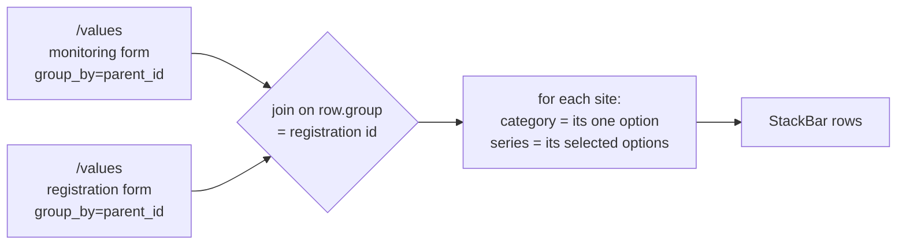

# Feature Design Document: Cross-Form Stacked Bar

**Task ID**: VIZ-015.a
**Author**: Iwan
**Date**: 2026-09-08
**Status**: Implemented, in the VIZ-015 PR (#349). 608 backend tests and 435
frontend tests across 49 suites pass; flake8, eslint and prettier clean.
Sections 7 and 10 were rewritten after the build to match
the shipped code rather than the sketch that preceded it, and §6, §7.4 and
§10 again after **VIZ-015 S-13** merged Group by and Stack by into a single
`Break down by` control for bar charts.

---

## 1. Context & Problem Statement

```
Currently:
- A bar chart can be stacked by another question of the SAME form (VIZ-015)
- The stack question is validated against `widget.form` in both the
  serializer and validate_widget, so a question on a sibling form is refused
- VIZ-015 recorded this as "cross-form stacking: not allowed", citing
  VIZ-001 D-3

Goal:
- Stack a bar by a question on another form in the same family, so a
  monitored observation can be split by a registration attribute
- Do it without a cross-form query, a new endpoint, or a data model change
```

The chart authors ask for next crosses the form boundary:

> Count of water systems by **project type** (asked on the monitoring
> form), each bar split by **implementing agency** (asked once, at
> registration).

Neither question can be moved. Project type is observed on each visit; the
implementing agency is a property of the site recorded when it was
registered. There is currently no way to express the combination.

This is not hypothetical — the chart is in production in `iwsims`, titled
"Implementation at Scale", against a Rural Water Project form family of the
same shape this repository seeds.

### The rule this revisits

VIZ-015's "not allowed" read VIZ-001 D-3 too broadly, and the codebase
already disagrees with that reading in two places:

- `ValuesFilterSerializer.validate` splits `criteria` into same-form and
  **parent-form** buckets, and `apply_parent_criteria_to_qs`
  ([functions.py:304](../../backend/api/v1/v1_visualization/functions.py#L304))
  resolves the parent's answers by matching `qs.parent_id`.
- A table column carries a `parent_answer` source that reads the
  registration parent, precisely so a monitoring table can show
  registration attributes.

D-3 constrains which form a widget is **bound** to — one form, so that
`sum_by` and `monitoring=latest` stay defined. It does not say a widget may
not *read* an answer across the parent link. Filters and table columns
already do; this extends the same allowance to the stacks.

---

## 2. Requirements

### User Acceptance Criteria

- [x] A bar chart's breakdown control offers option questions from the
      other forms in the dashboard's family, grouped and labelled by form
      name. Since S-13 they sit in the same list as Month, Date and
      Registration site, rather than appearing only once Group by had
      already been set to Registration site
- [x] Selecting one splits each bar by that question's options, counting
      **sites** rather than submissions
- [x] The legend shows the stacking question's option labels and colours
- [x] Only option / multiple-option questions are offered, and only from
      forms inside the dashboard's own family
- [x] The chart states that it counts sites, so a reader does not mistake
      it for a submission count — as a hint under the control, not as a
      caption on the chart itself. Originally the pinned Group by; since
      S-13 the single `Break down by` control, which no longer needs
      pinning because it writes `group_by=parent_id` itself

### Technical Acceptance Criteria

- [x] No new endpoint, no new query shape, no migration — two existing
      `/values` calls joined client-side
- [x] Both calls are `group_by=parent_id&stack_by=option`; the pairing is
      pinned, not offered (D-1)
- [x] The **category** call carries no `stack_question_id` — that
      parameter belongs to the same-form model, and sending it names a
      question on the wrong form (§4)
- [x] A site contributes 1 to its category bar and 1 per selected series
      option, regardless of how many times it was monitored
- [x] A widget with no `stack_form`, or with `stack_form == widget.form`,
      behaves exactly as VIZ-015 does today — one request, backend-computed
- [x] `stack_form` is refused unless it is the dashboard's root form or one
      of its monitoring children (VIZ-001 D-3 preserved)
- [x] A cross-form widget is refused unless `group_by=parent_id`; a
      same-form one is still refused unless `group_by=option` (VIZ-015 D-4)
- [x] The measured question must be single-choice for a cross-form chart,
      refused at save and withheld in the picker (D-3)
- [x] A public dashboard serves a cross-form widget to an anonymous caller
- [x] A deleted `stack_form` degrades to a visible broken widget, not a 400
- [x] Frontend eslint and prettier clean; backend flake8 clean

---

## 3. Data Model Changes

### New Models

**None.** No new tables, no new columns, no migration. The feature is two
keys in an existing `DashboardWidget.config` JSON field.

### Modified Models

| Model | Change | Reason |
|-------|--------|--------|
| `DashboardWidget` | none — `config` JSON gains two keys | `config` is schemaless by design (VIZ-001 §4.3) |

### Config shape

```json
{
  "group_by": "parent_id",
  "stack_by": "option",
  "stack_form": 1749621221728,
  "stack_question": 1749622571775
}
```

`stack_question` already exists from VIZ-015. `stack_form` is the whole
addition. When it is absent or equal to `widget.form`, every code path
behaves as VIZ-015 does today; when it differs, the widget switches to the
two-request model.

### Migration Strategy

```python
# None required.
# - No existing widget carries `stack_form`, so every stored dashboard
#   takes the unchanged path.
# - published_config snapshots are forward-compatible: an old snapshot
#   simply has no stack_form key.
# - Rollback is removing the key; no data is written that a reverted
#   build cannot read.
```

---

## 4. API Contract

### Endpoints

**No new endpoints.** The existing values endpoint is called twice.

| Method | URL | Purpose | Auth |
|--------|-----|---------|------|
| GET | `/api/v1/visualization/values` | Category call — the bars | Required, or a public dashboard slug |
| GET | `/api/v1/visualization/values` | Series call — the stacks | Required, or a public dashboard slug |

Both calls are pinned to `group_by=parent_id&stack_by=option`. That pairing
makes `row.group` the registration datapoint's id on either side, which is
the only key the two forms share (D-1).

**The category call must not carry `stack_question_id`.** This went unsaid
in the first draft and cost a bug: `buildRequest` added the parameter
whenever `config.stack_question` was set, which is right for VIZ-015 and
wrong here, because the id names a question on the *other* form. The
serializer then refuses it twice over — not on `form_id`, and
`stack_question_id` requires `group_by=option` while a cross-form chart is
pinned to `parent_id` — and the widget renders "Could not load this
widget's data" with nothing in the UI to say why.

The rule is therefore: `stack_question_id` belongs to the same-form model
only. A cross-form widget names its stacking question exclusively in the
second request.

### Request/Response Examples

The chart described in §1, spelled out end to end. Category is the
monitoring form's project type; series is the registration form's
implementing agency.

```
GET /api/v1/visualization/values
  ?form_id=1749621962296        # monitoring form
  &question_id=1749621851234    # type_of_project
  &monitoring=latest
  &group_by=parent_id
  &stack_by=option

GET /api/v1/visualization/values
  ?form_id=1749621221728        # registration form
  &question_id=1749622571775    # implementing_agencies
  &group_by=parent_id
  &stack_by=option
```

Responses. `group` is the registration datapoint's id, and it is the same
integer on both sides — that is the whole join:

```json
// category — the monitoring form's latest answer per site
{"data": [
  {"label": "Nadi Central RWS", "group": 7,
   "Surface Water Project": 1, "Borehole": 0,
   "Desalination": 0, "Rainwater Harvesting": 0},
  {"label": "Sigatoka Valley RWS", "group": 20,
   "Surface Water Project": 0, "Borehole": 1,
   "Desalination": 0, "Rainwater Harvesting": 0}
]}

// series — the registration form's answer per site
{"data": [
  {"label": "Nadi Central RWS", "group": 7,
   "Water Authority of Fiji": 0, "Mineral Resources Department": 1,
   "Rotary Pacific for Water Foundation": 1},
  {"label": "Sigatoka Valley RWS", "group": 20,
   "Water Authority of Fiji": 1, "Mineral Resources Department": 0,
   "Rotary Pacific for Water Foundation": 0}
]}
```

Joined into StackBar rows:

```json
[
  {"label": "Surface Water Project",
   "Mineral Resources Department": 1,
   "Rotary Pacific for Water Foundation": 1},
  {"label": "Borehole", "Water Authority of Fiji": 1}
]
```

Read that against the two inputs and every rule in this document is visible
in it. Site 7 answered "Surface Water Project" once, so it lands in exactly
one bar. It named two agencies, so it adds **one** to each — not two, and
not however many times it was monitored. Site 20 lands in `Borehole` and
adds one to its single agency. Neither site's monitoring count appears
anywhere: the bars are sites, which is what makes the axis read "Number of
RWS".

### Why no backend change is required

`_stack_option_by_parent` already emits exactly the shape the join
consumes, on both the `is_latest` and `is_registration_form` branches:

```python
# values_functions.py — the row it builds
row = {"label": p_name, "group": parent.id}
for option, label in zip(options, labels):
    row[label] = Answers.objects.filter(
        data_id__in=p_data_ids,
        question_id=question.id,
        options__contains=[option.value],
    ).count()
```

`group` is the parent id on the monitoring path and the registration's own
id on the registration path — the same number either way. That is the
single most important finding in this document: the backend is done.



---

## 5. Decision Log

### D-1: The join key is the registration datapoint, and nothing else

**Options Considered**:
1. Join on the registration datapoint id (`group_by=parent_id` on both)
2. Let the author pick `group_by`, and join on whatever comes back
3. Add a backend endpoint that joins server-side

**Decision**: Option 1. Both calls are pinned to `group_by=parent_id`, and
`group_by` is not offered while a cross-form stack is selected.

**Rationale**: The registration datapoint is the only key two forms in a
family share. A widget on the registration form returns one row per
registration; a widget on a monitoring form with `monitoring=latest`
returns one row per parent. Both key on `row.group`. No other pairing
joins at all, so offering the choice would be offering combinations that
silently return nothing — the exact failure VIZ-015's D-5 was written
about.

**Impact**: `group_by` becomes a derived value for cross-form widgets. The
Group by control is disabled and pinned rather than hidden, so an author
can see why.

### D-2: Both questions must be option-typed

**Options Considered**:
1. Option and multiple-option only
2. Allow any aggregatable type, deriving series from distinct values

**Decision**: Option 1, as VIZ-015.

**Rationale**: A stack needs a bounded series set, and so does a category
axis. A number or date question yields one series per distinct answer,
which is not a stacked bar.

**Impact**: The picker filters both sides; the validator refuses anything
else.

### D-3: The category question must be single-select

**Options Considered**:
1. Refuse a multi-select category question
2. Inherit iwsims' behaviour — take the first option with a count, drop
   the rest

**Decision**: Option 1.

**Rationale**: Option 2 drops half an answer without saying so. A site
that selected three project types would appear under one of them and the
chart would look complete. That is the same class of defect as VIZ-015's
D-1 — a plausible-looking wrong number — and it is worse here because
nothing in the output hints at the loss.

**Impact**: One more refusal in `validate_widget`, and the widget's own
question type is now part of cross-form validation rather than only the
stack question's.

### D-4: A site missing from the category response is dropped

**Options Considered**:
1. Drop it — no category, no bar
2. Add an "unknown" bar collecting them

**Decision**: Option 1, with the coverage surfaced in the widget.

**Rationale**: There is no honest bar to put it in. But the consequence
needs stating: where the category question lives on a monitoring form, the
chart counts only sites that have been monitored, which can be a small
fraction of the sites that exist. A chart showing 12 of 40 registered
systems is correct and reads as broken.

**Impact**: Shipped without a coverage caption. It would need a
denominator nothing currently fetches — the count of registrations in
scope — which is a third request for a footnote. The Group by hint says
the chart counts sites, which addresses the semantic half; the numeric
half is left open in §11. An "unknown" bucket remains available as a later
change if authors ask for it.

### D-5: Both calls carry the dashboard's filters

**Options Considered**:
1. Apply date and administration filters to both calls
2. Filter the category call only, since it defines the bars

**Decision**: Option 1.

**Rationale**: Under option 2 the bars and the segments describe different
populations, and the discrepancy reads as a data bug rather than a
configuration one — the hardest kind to trace.

**Impact**: The series request builder takes the same `filters` and
`dashboardSlug` arguments as the primary.

### D-6: A separate chart type, not a flag on VIZ-015

**Options Considered**:
1. A distinct cross-form model, selected by `stack_form`
2. One "Stack by" control that silently switches semantics when the
   chosen question happens to live on another form

**Decision**: Option 1.

**Rationale**: The two count different things:

| | VIZ-015 cross-tab | VIZ-015.a cross-form |
|---|---|---|
| Requests | one | two, joined in the browser |
| Forms | same form only | any two in the family |
| Unit counted | **submissions** per (A,B) cell | **sites** — 1 per site, +1 per series option |
| `group_by` | the author's choice | forced `parent_id` |
| Measure | the widget's own | each side carries its own |

A site monitored twelve times contributes 12 to one and 1 to the other.
Hiding that behind one control means an author changes the stacking
question and the numbers change meaning with no indication.

**Impact**: `group_by` is what tells a reader which model a stored config
uses — `option` is same-form, `parent_id` is cross-form — without
comparing form ids.

### D-7: The join lands in `util/`, and is not called `crossTab`

**Options Considered**:
1. `util/dashboardCrossForm.js`, exporting `stackAcrossForms`
2. Port iwsims' path and name: `components/dashboard/compute/crossTab.js`

**Decision**: Option 1.

**Rationale**: `compute/` exists in iwsims because their widgets are static
JSON carrying a `compute:` key that dispatches to a directory of
transforms. We have no such key and no such directory; creating one to hold
a single file would be importing an architecture to justify a filename.

`crossTab` is also already taken one layer down: `_stack_option_crosstab`
([values_functions.py:1147](../../backend/api/v1/v1_visualization/values_functions.py#L1147))
is VIZ-015's same-form cross-tab — one request, server-side, counting
submissions. Two different computations sharing a name across the stack is
how they get conflated in review, and D-6 exists precisely because they
must not be.

**Impact**: Lands beside its closest sibling `util/dashboardMeasure.js` — a
pure dashboard-domain transform with a named export, a default export, and
a matching test file.

---

## 6. Type/Constant Mappings

The Select carries a scalar, the config carries up to three fields, and the
request carries either a parameter or a whole second call. Three
representations of one choice:

| Builder Select value | Stored in `config` | Sent to `/values` | Means |
|---|---|---|---|
| `""` | `stack_by: null` | — | None |
| `"option"` | `stack_by: "option"` | `stack_by=option` | This question's own options |
| `"parent_id"` | `stack_by: "parent_id"` | `stack_by=parent_id` | Registration site |
| `"q:<questionId>"` | `stack_by: "option"`, `stack_question` | `stack_question_id` | Another question, same form (VIZ-015) |
| `"f:<formId>:<questionId>"` | `stack_by: "option"`, `stack_question`, `stack_form` | two calls, no `stack_question_id` | Another form's question (this document) |

Both prefixes are **UI-only**. They exist because antd's `Select` value is
a scalar while the choice writes two or three config fields; they are
unwrapped on change and never stored nor sent. The reader and the writer
are exported as a pair so the mapping is testable without rendering the
inspector.

**Which pair depends on the widget type, since S-13.** A bar chart's
merged control uses `breakdownValueOf` / `breakdownChangeOf`; line and pie
keep `stackValueOf` / `stackChangeOf` alongside their Group by. The wire
format is identical — the same `f:<formId>:<questionId>` string, the same
four config fields — so a stored cross-form widget reads back the same
either way. What changed is that the merged writer sets `group_by` itself
rather than relying on Group by having already been set:

| Control | Reader | Writer | `group_by` |
|---|---|---|---|
| Break down by (bar) | `breakdownValueOf` | `breakdownChangeOf` | written by the choice |
| Stack by (line, pie) | `stackValueOf` | `stackChangeOf` | the author's, validated after |

Note the last row's request column: a cross-form choice sends **no**
`stack_question_id` at all. Mixing the two — the parameter *and* the second
call — is the defect recorded in §4.

| Broken reason | Cause | Precedence |
|---|---|---|
| `form_deleted` | `widget.form` gone | 1 (widest) |
| `question_deleted` | `widget.question` gone | 2 |
| `stack_form_deleted` | `config.stack_form` gone | 3 |
| `stack_question_deleted` | `config.stack_question` gone | 4 |

---

## 7. Implementation

### 7.1 The join

`frontend/src/util/dashboardCrossForm.js`, ported from iwsims'
`computeCrossTab` and renamed per D-7. Names differ from that original
where ours read better in this codebase — `answeredOptions` rather than
`optionColumnsWithCount`, `barBySite` rather than `categoryByParent`:

```js
const NON_OPTION_KEYS = new Set(["label", "group"]);

const answeredOptions = (row) =>
  Object.keys(row).filter((key) => !NON_OPTION_KEYS.has(key) && row[key] > 0);

export const stackAcrossForms = ({ category, series } = {}) => {
  const categoryRows = category?.data || [];
  const seriesRows = series?.data || [];
  if (categoryRows.length === 0) {
    return [];
  }

  // Pass 1: which bar each site belongs to. The category question is
  // validated single-select, so a site has one answer and `[0]` is it
  // rather than the first of several silently dropped.
  const barBySite = new Map();
  const ordered = [];
  categoryRows.forEach((row) => {
    const answered = answeredOptions(row);
    if (answered.length === 0) {
      return;                        // no category answer, so no bar (D-4)
    }
    barBySite.set(row.group, answered[0]);
    if (!ordered.includes(answered[0])) {
      ordered.push(answered[0]);
    }
  });

  // `label`, not `category`: akvo-charts reads the first key of a row as
  // its category axis.
  const bars = new Map(ordered.map((label) => [label, { label }]));

  // Pass 2: every site adds ONE per series option it selected.
  seriesRows.forEach((row) => {
    const label = barBySite.get(row.group);
    if (typeof label === "undefined") {
      return;                        // in series, not in category: dropped
    }
    const bar = bars.get(label);
    answeredOptions(row).forEach((option) => {
      bar[option] = (bar[option] || 0) + 1;
    });
  });

  return Array.from(bars.values());
};

export default stackAcrossForms;
```

Three details that are easy to miss and all matter:

- `bar[option] + 1`, never `+ row[option]`. A site that answered the series
  question on twelve monitoring visits still counts once. This single `+ 1`
  **is** the per-site semantics of D-6.
- `row[key] > 0` treats the response's counts as booleans. That is why the
  same join works whether a side came back from the registration path
  (counts are 0/1) or the monitoring path (counts can be higher).
- The default `= {}` on the parameter: `normalize` calls this before the
  second response has arrived, so it must survive being handed nothing.

### 7.2 The two requests

`isCrossForm` is the single predicate that selects between the two models,
and everything else keys off it:

```js
const isCrossForm = (widget) => {
  const config = widget?.config || {};
  return Boolean(
    config.stack_form &&
      config.stack_form !== widget?.form &&
      config.stack_question
  );
};
```

It gates the **category** call's parameters as well as the series call's —
the omission that caused the bug recorded in §4:

```js
// buildRequest, the primary call
      stack_question_id: isCrossForm(widget) ? null : config.stack_question,
```

And it is the whole guard on the series call:

```js
const buildSeriesRequest = (widget, filters, dashboardSlug) => {
  if (!isCrossForm(widget)) {
    return null;                       // same-form: VIZ-015 handles it
  }
  const config = widget.config;
  return {
    endpoint: "visualization/values",
    params: compact({
      form_id: config.stack_form,
      question_id: config.stack_question,
      group_by: "parent_id",           // pinned, not the author's (D-1)
      stack_by: "option",
      administration_id: filters?.administration_id,
      ...dateFilters(filters),         // D-5: both sides, same window
      dashboard: dashboardSlug,
    }),
  };
};
```

The hook calls it exactly as it already calls the map's `statusRequest` —
unconditionally, with a null endpoint when unused, so hook order never
varies. Its loading and error states join the union rather than being
ignored:

```js
    loading: primary.loading || status.loading || series.loading,
    error: primary.error || status.error || series.error,
```

That is deliberate: a cross-form chart drawn from only half its data is a
wrong chart, not a partial one — it would render the category response
unjoined, which is a different and plausible-looking picture.

In `normalize`, the join runs **before** the projection, and the legend
switches source with it:

```js
  // `config.stack_by` says what the author asked for; `stack_labels` says
  // what the server returned. VIZ-015 S-12 gates on the second, because
  // the two disagree when the backend declines a self-cross-tab.
  if (stacked) {
    const crossForm = isCrossForm(widget);
    // The legend describes the SERIES question: the category response's
    // labels are the bars.
    const legend = crossForm ? seriesResponse : response;
    const stackLabels = legend?.stack_labels || [];
    const stackRows = crossForm
      ? stackAcrossForms({ category: response, series: seriesResponse })
      : rows;

    // …then the VIZ-015 S-10 projection, which drops `group` — the join
    // key — along with every other non-stack key. Joining after this
    // would match nothing and render empty with no error anywhere.
    const categoryOf = (row) => row.label ?? row.month ?? row.date ?? null;
    return {
      data: stackRows.map((row) =>
        stackLabels.reduce(
          (projected, key) => ({ ...projected, [key]: row[key] ?? 0 }),
          { label: categoryOf(row) }
        )
      ),
      extraConfig: { stackMapping: { stack: stackLabels } },
      color: usableColors(legend?.colors),
    };
  }
```

`categoryOf` rather than `row.label` because the parent-stacked number
paths key their rows `month`/`date` — see VIZ-015 S-13. The join's own
rows always carry `label`, so this costs the cross-form path nothing; it
is here because the projection is shared.

Colours come from the series response too, through the same
all-or-nothing `usableColors` guard VIZ-015 added.

### 7.3 Validation

In `validate_widget`, inside the `stack_question` block VIZ-015 added. The
shipped version resolves which model it is first, then applies that model's
rules:

```python
        # Which of the two stacking models this is. Same-form is a
        # cross-tab of submissions under group_by=option; cross-form is a
        # join of sites under group_by=parent_id. They are mutually
        # exclusive, so group_by alone tells a reader which a stored
        # config uses, without comparing form ids.
        stack_form_id = _as_int(config.get("stack_form"))
        is_cross_form = (
            stack_form_id is not None
            and form is not None
            and stack_form_id != form.id
        )

        if not is_cross_form and config.get("group_by") != "option":
            return _error(
                "stack_question requires group_by=option",
                index, "config.stack_question",
            )

        stack_form = form
        if is_cross_form:
            stack_form = forms.filter(pk=stack_form_id).first()
            if stack_form is None:
                return _error(
                    "stack form not found", index, "config.stack_form"
                )
            # The same family test widget.form already passes, so
            # VIZ-001 D-3 stays intact.
            if not (
                stack_form.id == root_form.id
                or stack_form.parent_id == root_form.id
            ):
                return _error(
                    "stack form must be the dashboard's root form or one "
                    "of its monitoring forms",
                    index, "config.stack_form",
                )
            if config.get("group_by") != "parent_id":
                return _error(
                    "a cross-form stack requires group_by=parent_id",
                    index, "config.stack_form",
                )
            if question is not None and (
                question.type != QuestionTypes.option
            ):
                # The join takes one category answer per site, so a
                # multi-select measured question would have every answer
                # after the first dropped without a word.
                return _error(
                    "a cross-form stack requires a single-select question",
                    index, "question",
                )

        stack_question = questions.filter(
            pk=_as_int(stack_question_id),
        ).first()
        if stack_question is None or stack_form is None or (
            stack_question.form_id != stack_form.id
        ):
            return _error(
                "stack question must belong to the stack form"
                if is_cross_form
                else "stack question must belong to the widget's form",
                index, "config.stack_question",
            )
```

One thing the sketch missed: `question` was only bound inside
`if question_id is not None`, so reading it here raised `NameError` for a
widget with no question. It is now initialised to `None` above.

Note the D-3 refusal reports field `question`, not `config.stack_question`
— the offending control is the Question picker, and pointing the author at
the stack would send them to the wrong dropdown.

### 7.4 Inspector

`stackByOptions` grew two parameters, `family` and `widgetFormId`, and a
guard the sketch did not anticipate:

```js
  if (groupBy === "parent_id") {
    // A multi-select measured question is excluded: the join takes a
    // site's single category answer, and offering a question whose answer
    // it would truncate is offering a chart that quietly drops data.
    if (question.type !== "option") {
      return [...none, ...own];
    }
    const groups = (family || [])
      .filter((f) => f.id !== widgetFormId)
      .map((f) => ({
        label: f.name,                 // rendered as an antd <OptGroup>
        options: (f.questions || [])
          .filter((q) => STACK_QUESTION_TYPES.has(q.type))
          .map((q) => ({
            value: `f:${f.id}:${q.id}`,
            label: q.label || q.name,
          })),
      }))
      .filter((g) => g.options.length > 0);
    return [...none, ...own, ...groups];
  }
```

The grouping is not cosmetic. VIZ-015's flat list is already at its
legibility limit with one form's option questions in it, and a family adds
every sibling form's on top. A monitoring form carrying thirty option
questions is ordinary, so an ungrouped list would run to fifty entries with
no indication which form each came from.

The encode/decode pair was extracted rather than written inline in JSX, so
the three representations of one choice live in one place and are testable
without rendering:

```js
export const stackValueOf = (config) => {
  if (config?.stack_form && config?.stack_question) {
    return `f:${config.stack_form}:${config.stack_question}`;
  }
  if (config?.stack_question) {
    return `q:${config.stack_question}`;
  }
  return config?.stack_by || "";
};

export const stackChangeOf = (value, currentGroupBy) => {
  if (value.startsWith("f:")) {
    const [formId, questionId] = value.slice(2).split(":");
    return {
      stack_by: "option",
      stack_question: Number(questionId),
      stack_form: Number(formId),
      // Cross-form only draws per site. Pinned here rather than left to
      // the Group by control so the config is never momentarily invalid.
      group_by: "parent_id",
    };
  }
  // …`q:` and the fixed values clear stack_form and keep the grouping.
};
```

`withValidStack` reads through `stackValueOf` and has to look inside
groups, since a cross-form entry is nested one level down:

```js
  const offered = choices.some((c) =>
    c.options ? c.options.some((o) => o.value === current) : c.value === current
  );
```

`pruneConfigForForm` clears `stack_form` alongside `stack_question` — the
pair is meaningless apart, and a stack form with no question asks for
nothing.

The Group by control is disabled and pinned to `Registration site` while a
cross-form stack is selected, with a hint saying the chart counts sites.

**`groupByOptions` has to know about `stack_form`, and checking it last is
a bug.** VIZ-015's D-6 gave Group by the same treatment Stack by got —
offer only what draws — and its rule reads the config's stacking keys. A
cross-form widget carries `stack_by` *and* `stack_question`, so a rule
that checks those first classifies it as the same-form cross-tab and
answers `["option"]`. `withValidGroupBy` then finds the stored `parent_id`
missing from that list and snaps it to `option`, which the serializer
refuses — and the Stack by control, which only offers cross-form entries
under `parent_id`, stops offering the entry the widget is already using and
falls back to rendering the raw `f:…` value.

One omitted branch, three visible symptoms, none of them near each other.
So the check comes first, before the question type is even consulted:

```js
  // A cross-form stack joins two responses on the registration datapoint,
  // which is only a key under parent_id. Checked before the question type
  // because it holds whatever the question is.
  if (config?.stack_form) {
    return by("parent_id");
  }
```

and `groupByIsForced` excludes the cross-form case, so the control keeps
its disabled-with-a-hint treatment rather than disappearing: here a choice
was taken away by something the author did, which is the half of VIZ-015's
D-6 rule that calls for disabling.

**S-13 retired all of this for bar charts, and the reasons it existed are
why.** Everything from `groupByOptions` checking `stack_form` first, to
`withValidStack` looking inside groups, to `crossFormWithheld` explaining
an absence, was work to keep two controls agreeing about one idea. The
merged `Break down by` list has no second control to agree with:

- The cross-form entries sit in the same list as Month, Date and
  Registration site, so the "invisible until Group by is right" problem
  that `crossFormWithheld` half-answered cannot arise. Discoverability was
  the strongest argument for the merge, and it came from this feature.
- `breakdownChangeOf` writes `group_by: "parent_id"` as part of the
  choice, so no ordering bug is possible between the two controls and
  nothing needs pinning.
- The multi-select exclusion stays, one level up: `breakdownOptions`
  offers the sibling-form groups only when the measured question is
  single-choice (D-3).

`groupByOptions`, `stackByOptions`, `withValidStack`, `withValidGroupBy`
and `crossFormWithheld` all remain — line and pie still use them. They are
simply no longer the bar chart's path.

**And one hint the sketch had no idea it needed.** When everything is in
place except the measured question's type, the other-form entries simply
are not there — which reads as the feature being absent rather than
unavailable. That is the invisible constraint VIZ-015's D-5 was written
about, reintroduced two commits after writing it down, and reported as "I
don't see any changes". So:

```js
  const crossFormWithheld =
    wType === "bar" &&
    (wConfig.group_by || "option") === "parent_id" &&
    selectedQuestion?.type === "multiple_option" &&
    forms.some((f) => f.id !== widget.form);
```

renders a line beneath the control explaining that a single-choice question
is needed and why.

---

## 8. Compatibility & Migration

### Backward Compatibility

- [x] Existing API consumers unaffected — no endpoint, parameter or
      response shape changes
- [x] Existing data preserved — no widget carries `stack_form`, so every
      stored dashboard takes the VIZ-015 path unchanged
- [x] Published snapshots forward-compatible — an old snapshot simply has
      no `stack_form` key
- [x] CLI tools still work — nothing here touches seeders or management
      commands

### Mobile App Impact

- [x] Sync endpoints affected: **none**. Dashboards are web-only; the
      mobile app never calls `/visualization/*`
- [x] SQLite schema changes: **no**
- [x] Version detection: **not applicable**

### Seeder/CLI Compatibility

- [x] Existing seeders work — no model or fixture change
- [ ] New seeder commands needed: none

---

## 9. Security Considerations

- [x] **Permission model**: unchanged. Both calls go through the same
      `resolve_view_scope` and tenant scoping as every other `/values`
      request; neither can name a form outside the caller's tenant.
- [x] **The family bound is the real constraint**: `stack_form` is
      validated against the dashboard's root form and its monitoring
      children, so a widget cannot reach a form in another family even
      inside the same tenant. VIZ-001 D-3 is preserved, not widened.
- [x] **Public dashboards need the allowlist extended.** `allowlist_from`
      bounds what an anonymous caller may ask about, and this is the first
      config key that contributes a **form** id — until now `forms` held
      only the widgets' own `form` keys:

```python
        # VIZ-015 added this one:
        stack_qid = _as_id(widget_config.get("stack_question"))
        if stack_qid is not None:
            questions.add(stack_qid)

        # VIZ-015.a: a FORM id from config. Without it a public dashboard
        # refuses to serve its own widget.
        stack_form_id = _as_id(widget_config.get("stack_form"))
        if stack_form_id is not None:
            forms.add(stack_form_id)
```

`_as_id` rather than the raw value, for the reason the function already
documents: a malformed id must narrow the allowlist, never crash every
public view of the dashboard.

- [x] **Deleted forms degrade visibly.** `annotate_broken` gains a reason,
      ordered so the widest cause wins:

```python
        if form_id and form_id not in live_forms:
            reason = "form_deleted"
        elif question_id and question_id not in live_questions:
            reason = "question_deleted"
        elif stack_form_id and stack_form_id not in live_forms:
            reason = "stack_form_deleted"
        elif stack_question_id and (
            stack_question_id not in live_questions
        ):
            reason = "stack_question_deleted"
```

- [x] No new attack vectors: no new endpoint, no new query shape, no
      user-supplied SQL or field names — `stack_form` and `stack_question`
      are integers resolved through the ORM.

---

## 10. Testing Strategy

| Test Type | Coverage |
|-----------|----------|
| Unit (frontend) | The join as a pure function; the request builder; the inspector's encoding and pruning |
| Unit (backend) | Validation refusals; allowlist collection; broken-reason precedence |
| Integration | A cross-form widget saved, published, and served to an anonymous caller |
| Contract | The `/values` response still carries `group` on both paths |

**Forty-three tests across seven files** when this shipped, listed as they
exist rather than as they were planned. S-13 later moved the inspector's
fourteen onto the merged control's helpers — the assertions are the same
rules, read through `breakdownOptions` and `breakdownChangeOf` instead of
`stackByOptions` and `stackChangeOf`. The ones marked **guard** protect an invariant that
already holds and would break this feature quietly if changed for an
unrelated reason.

### `util/__test__/dashboardCrossForm.test.js` — the join (12)

The semantics live here, so it carries the most tests and none need React.

| Test | Asserts |
|---|---|
| joins two responses on `group` | one row per bar, keyed by the registration id |
| a site counts once however large the series count is | a response carrying `12` still contributes `1` — the `+ 1`-not-`+ row[option]` line, and it *is* the per-site model |
| a multi-select series adds to every option selected | a site naming two agencies increments both |
| a site in series but not in category is dropped | registered but never monitored: no bar to belong to (D-4) |
| a site with no category answer is dropped, series and all | its contribution leaves with it |
| bars keep first-seen category order | not Map iteration luck |
| an empty category response returns nothing | the early guard, not a crash |
| an empty series response leaves bars with no segments | the honest render of "no site answered" |
| `label` and `group` are never treated as option columns | `NON_OPTION_KEYS` |
| a zero column contributes nothing | `row[key] > 0`, not `key in row` |
| the category side tolerates counts above one | truthiness, not magnitude |
| survives being called with nothing | `normalize` calls it before the second response lands |

### `util/__test__/useWidgetData.test.js` — fetching and ordering (11)

| Test | Asserts |
|---|---|
| no `stack_form` means one request, as before | same-form widgets take the VIZ-015 path untouched |
| a `stack_form` equal to the widget's form is not cross-form | "cross-form to itself" is same-form |
| a `stack_form` without a `stack_question` asks for nothing extra | half-configured widgets fetch nothing |
| a cross-form widget issues exactly two values calls | and a same-form widget exactly one |
| **guard** the primary call does not carry `stack_question_id` | the §4 rule. Asserting only the call *count* missed this and shipped a 400 |
| **guard** a same-form stack still carries `stack_question_id` | the fix must not break the model it does not apply to |
| the series call pins `group_by` and `stack_by` | D-1; not the author's to choose |
| the series call carries the dashboard filters | D-5 — otherwise bars and segments describe different populations |
| **guard** the join runs before the projection | reversed, it matches nothing and renders empty with no error anywhere |
| the legend describes the series question, not the bars | the category response's labels are the bars |
| a partly-null series palette falls back to the widget colour | reuses VIZ-015's `usableColors` |

### `pages/dashboards/__test__/BuilderInspector.test.js` — the control (14)

| Test | Asserts |
|---|---|
| another form's questions appear only under `parent_id` | D-1, enforced in the picker before the serializer sees it |
| they are grouped by form name | the `OptGroup` heading |
| the widget's own form is not offered as a group | its questions are already in the flat list |
| non-option questions on other forms are excluded | D-2 |
| a multi-select measured question is not offered cross-form | D-3, in the picker |
| a cross-form config round-trips through the Select value | `stackValueOf`, not just the write |
| selecting a form entry writes all four fields at once | one update, so the config is never momentarily invalid |
| a same-form entry clears `stack_form` and keeps the grouping | switching models must not leave the other's key behind |
| None clears everything but the grouping | |
| `withValidStack` keeps a cross-form choice the groups still offer | it must look *inside* groups, not only at flat entries |
| `withValidStack` clears a cross-form choice the groups dropped | a stranded selection is a guaranteed 400 |
| changing the widget's form clears a cross-form stack | `pruneConfigForForm` clears the pair together |
| a cross-form stack pins the grouping to the site | the omission above, which snapped a working widget to `option` |
| it pins the grouping whatever the measured question is | the check runs before the question type is consulted |

### `tests_dashboard_validation.py` — save time (7)

| Test | Asserts |
|---|---|
| a valid cross-form stack is accepted | the happy path, so the refusals mean something |
| `stack_form` must exist | field `config.stack_form` |
| `stack_form` must be in the family | VIZ-001 D-3 holds for the second form |
| cross-form requires `group_by=parent_id` | all three other groupings refused, never overridden |
| `stack_question` must be on the stack form | the rule that moved, from widget form to stack form |
| cross-form requires a single-select question | D-3, reported against `question` |
| `stack_form == widget.form` is same-form | and judged by VIZ-015's rules, not these |

### `tests_public_scope.py` — anonymous readers (2)

| Test | Asserts |
|---|---|
| a cross-form stack contributes a form **and** a question | the first config key ever to add a form id |
| a malformed `stack_form` narrows rather than crashes | `_as_id`'s existing contract |

### `tests_dashboard_snapshot.py` — after publish (4)

| Test | Asserts |
|---|---|
| a deleted `stack_form` breaks its widget | rather than 400ing the viewer |
| a deleted `stack_form` wins over its own question | widest cause first |
| the widget's own form still wins over the stack form | |
| a live cross-form widget is not broken | so the checks cannot pass by flagging everything |

### `tests_values_stack.py` — the contract this design leans on (2)

| Test | Asserts |
|---|---|
| **guard** registration rows carry their own id as `group` | the join key exists |
| **guard** monitoring rows carry the **parent's** id as `group` | the same integer on both sides, which is the entire reason the join works |

These last two are the cheapest insurance here. Nothing in the backend
knows it is participating in a join, so a later "the response carries a
redundant `group`, drop it" is a one-line change that passes every backend
test and silently empties this chart.

### Manual test plan

Automated tests confirm the join; only a person reading real numbers
confirms that the numbers mean what the chart claims. The two defects that
mattered most in VIZ-015 — datapoint ids drawn as bars, and Stack by
offering combinations that drew nothing — both passed every test and were
caught by looking.

Run against a family with a registration form and at least one monitoring
child. The examples below name the Rural Water Project family; substitute
your own.

**One thing decides whether the entries appear at all**, and getting it
wrong makes the feature look absent rather than unavailable:

**The Question must be single-choice.** A cross-form stack takes one
category answer per site. Pick a multi-choice question and the other-form
groups are withheld. The stacking question *may* be multi-choice; only the
measured one may not.

The old second condition — Group by set to Registration site — is gone
with S-13. It was the harder of the two to discover, which is what made
the merge worth doing.

A worked configuration, reproducing iwsims' "Implementation at Scale":

| Field | Value |
|---|---|
| Data source | a **monitoring** form (e.g. Rural Water Project - Monitoring) |
| Question | a **single-choice** question on it (e.g. "Type of Project?") |
| Measure | Current status of each site |
| Break down by | under the group named after the registration form → e.g. "Who is the project Implementing agency/agencies?" (multi-choice is fine here) |
| Orientation | Horizontal |

There is no Group by step any more: the choice writes `parent_id` itself.

| # | Steps | Expect |
|---|---|---|
| M-1 | Build the widget above, stopping before Break down by | The list runs None / Month / Date / Registration site, then this form's other option questions, then a group per **other** form in the family, each headed by the form's name |
| M-2 | Pick a question under one of those groups | The chart redraws with the other form's options as its legend. No second control moves — the choice wrote the grouping itself |
| M-3 | Read the bars against the data | Each bar is a category option; each segment counts **sites**, not submissions. A site monitored ten times adds 1 |
| M-4 | Change Question to a **multi-choice** question | The other-form groups disappear, and the cross-form selection is snapped by `withValidBreakdown` rather than left unsaveable |
| M-5 | Pick Month, then Registration site again | Both `stack_form` and `stack_question` are cleared on the way out and rewritten on the way back — a half-cleared pair is a guaranteed 400 |
| M-6 | Change Data source to another form | Any cross-form stack is cleared, and the widget still saves |
| M-7 | Save, reload the page | The widget returns with its form, question and stack intact, and draws the same chart |
| M-8 | Publish, then open the dashboard viewer | Identical to the builder canvas — both share `useWidgetData`, so a difference means a config that did not survive publish |
| M-9 | Make the dashboard public, open it signed out (or in a private window) | The chart renders. A blank widget here means `allowlist_from` did not collect `stack_form`, the one failure this feature can cause for anonymous readers |
| M-10 | Soft-delete the stacking form, reload the viewer | The broken-widget placeholder, not an error page and not a silently empty chart |

Two things worth watching while clicking through, both from VIZ-015:

- **Bar heights.** If any bar is orders of magnitude larger than the others
  and roughly the size of a datapoint id, a structural key is being plotted
  as a series again.
- **Legend contents.** It must list the *stacking* question's options. If
  it lists the measured question's, or contains an entry named `group`, the
  wrong response is feeding the legend.
- **"Could not load this widget's data."** Open the network tab and read
  the category call. If it carries `stack_question_id`, the primary
  request is naming a question on the other form — the §4 rule, and the
  defect that shipped once already.
- **Bars labelled `undefined`.** Not this feature: the shared projection
  reads the category key, and the parent-stacked number paths use
  `month`/`date` rather than `label` (VIZ-015 S-13). The join's own rows
  always carry `label`, so a cross-form chart cannot hit it.

## 11. Open Questions

- [ ] **How should the widget surface its site coverage (D-4)?** A caption
      ("12 of 40 sites monitored") needs a denominator nothing currently
      fetches — the count of registrations in scope — which is a third
      request for a footnote. Shipped without it. The Group by hint says
      the chart counts sites, which addresses the semantic confusion; the
      coverage number is a separate, later question.
- [ ] **Is an "unknown" category bar wanted?** D-4 drops sites with no
      category answer. Authors may prefer to see them collected; deferred
      until someone asks, since inventing a bucket nobody requested is how
      a chart acquires a category that means "our data is incomplete".

### Resolved

- **Does this ship in the VIZ-015 PR?** Yes — design and implementation
  both. The earlier recommendation was to split them, on the grounds that a
  reviewer holding two stacking models at once reviews neither well. That
  was overruled for a better reason: one person is carrying both, and a
  reviewer who sees only half the stacked-bar feature cannot judge whether
  the halves belong together. Splitting would have optimised for the
  reviewer's page count at the cost of their understanding.
- **Should D-3's single-select rule be enforced in the picker or only at
  save?** Both, in the end. The picker withholds cross-form entries when
  the measured question is multi-select, and `validate_widget` refuses the
  pairing regardless — the same belt-and-braces VIZ-015's D-5 settled on,
  for the same reason: an offered choice that 400s is worse than a choice
  never offered, but the API is reachable without the picker.
- **Does the auto-preview make this expensive?** No, and it was worth
  checking, because the builder refetches on every inspector change with no
  debounce. `useVisualizationRequest` carries a 200-entry LRU keyed on
  endpoint plus params, so changing only the stacking question leaves the
  category call's key untouched and hits the cache: one new request, not
  two. Selecting a cross-form entry repins `group_by` and so costs two,
  once. Backtracking is free.
- **Can the builder reach the sibling forms' questions?** Already could.
  `/sources` returns every form in the family with its `questions[]`, and
  `DashboardBuilder` loads it once into `sources`. The picker needed no new
  endpoint, no new fetch, and no prop-drilling — it was the cheapest part
  of the whole design, not the most expensive.

---

## 12. References

- Related tasks:
  [VIZ-015](VIZ-015-bar-chart-stacking-by-question.md) (same-form
  stacking, shipped),
  [VIZ-001](VIZ-001-dashboard-builder-data-architecture.md) §4.3 config
  shape and D-3 form binding
- Prior art: `iwsims`
  `frontend/src/components/dashboard/compute/crossTab.js` and the
  `chart_implementation_at_scale` widget in
  `frontend/src/config/visualizations/`
- Code added:
  [`dashboardCrossForm.js`](../../frontend/src/util/dashboardCrossForm.js)
  and its test — the join, and the only new file in the change
- Code touched:
  [`dashboard_functions.py`](../../backend/api/v1/v1_visualization/dashboard_functions.py),
  [`public_scope.py`](../../backend/api/v1/v1_visualization/public_scope.py),
  [`dashboard_snapshot.py`](../../backend/api/v1/v1_visualization/dashboard_snapshot.py),
  [`useWidgetData.js`](../../frontend/src/util/hooks/useWidgetData.js),
  [`builderConstants.js`](../../frontend/src/pages/dashboards/builderConstants.js),
  [`BuilderInspector.jsx`](../../frontend/src/pages/dashboards/BuilderInspector.jsx)

---

## Approval

| Role | Name | Date | Status |
|------|------|------|--------|
| Developer | | | |
| Tech Lead | | | |
| Product | | | |
