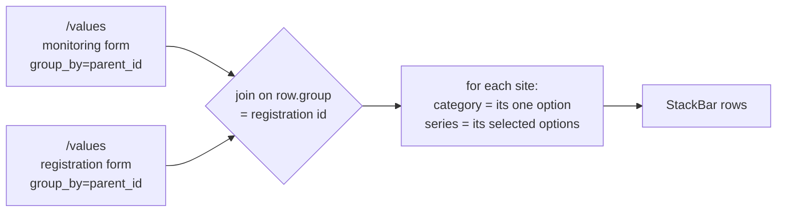

# Feature Design Document: Cross-Form Stacked Bar

**Task ID**: VIZ-015.a
**Author**: Iwan
**Date**: 2026-09-08
**Status**: Draft (not implemented; design ships with the VIZ-015 PR)

---

## 1. Context & Problem Statement

```
Currently:
- A bar chart can be stacked by another question of the SAME form (VIZ-015)
- The stack question is validated against `widget.form` in both the
  serializer and validate_widget, so a question on a sibling form is refused
- VIZ-015 recorded this as "cross-form stacking: not allowed", citing
  VIZ-001 D-3

Goal:
- Stack a bar by a question on another form in the same family, so a
  monitored observation can be split by a registration attribute
- Do it without a cross-form query, a new endpoint, or a data model change
```

The chart authors ask for next crosses the form boundary:

> Count of water systems by **project type** (asked on the monitoring
> form), each bar split by **implementing agency** (asked once, at
> registration).

Neither question can be moved. Project type is observed on each visit; the
implementing agency is a property of the site recorded when it was
registered. There is currently no way to express the combination.

This is not hypothetical — the chart is in production in `iwsims`, titled
"Implementation at Scale", against a Rural Water Project form family of the
same shape this repository seeds.

### The rule this revisits

VIZ-015's "not allowed" read VIZ-001 D-3 too broadly, and the codebase
already disagrees with that reading in two places:

- `ValuesFilterSerializer.validate` splits `criteria` into same-form and
  **parent-form** buckets, and `apply_parent_criteria_to_qs`
  ([functions.py:304](../../backend/api/v1/v1_visualization/functions.py#L304))
  resolves the parent's answers by matching `qs.parent_id`.
- A table column carries a `parent_answer` source that reads the
  registration parent, precisely so a monitoring table can show
  registration attributes.

D-3 constrains which form a widget is **bound** to — one form, so that
`sum_by` and `monitoring=latest` stay defined. It does not say a widget may
not *read* an answer across the parent link. Filters and table columns
already do; this extends the same allowance to the stacks.

---

## 2. Requirements

### User Acceptance Criteria

- [ ] A bar chart's "Stack by" offers option questions from the other forms
      in the dashboard's family, grouped and labelled by form name
- [ ] Selecting one splits each bar by that question's options, counting
      **sites** rather than submissions
- [ ] The legend shows the stacking question's option labels and colours
- [ ] Only option / multiple-option questions are offered, and only from
      forms inside the dashboard's own family
- [ ] The chart states that it counts sites, so a reader does not mistake
      it for a submission count

### Technical Acceptance Criteria

- [ ] No new endpoint, no new query shape, no migration — two existing
      `/values` calls joined client-side
- [ ] Both calls are `group_by=parent_id&stack_by=option`; the pairing is
      pinned, not offered (D-1)
- [ ] A site contributes 1 to its category bar and 1 per selected series
      option, regardless of how many times it was monitored
- [ ] A widget with no `stack_form`, or with `stack_form == widget.form`,
      behaves exactly as VIZ-015 does today — one request, backend-computed
- [ ] `stack_form` is refused unless it is the dashboard's root form or one
      of its monitoring children (VIZ-001 D-3 preserved)
- [ ] A cross-form widget is refused unless `group_by=parent_id`; a
      same-form one is still refused unless `group_by=option` (VIZ-015 D-4)
- [ ] A public dashboard serves a cross-form widget to an anonymous caller
- [ ] A deleted `stack_form` degrades to a visible broken widget, not a 400
- [ ] Frontend eslint and prettier clean; backend flake8 clean

---

## 3. Data Model Changes

### New Models

**None.** No new tables, no new columns, no migration. The feature is two
keys in an existing `DashboardWidget.config` JSON field.

### Modified Models

| Model | Change | Reason |
|-------|--------|--------|
| `DashboardWidget` | none — `config` JSON gains two keys | `config` is schemaless by design (VIZ-001 §4.3) |

### Config shape

```json
{
  "group_by": "parent_id",
  "stack_by": "option",
  "stack_form": 1749621221728,
  "stack_question": 1749622571775
}
```

`stack_question` already exists from VIZ-015. `stack_form` is the whole
addition. When it is absent or equal to `widget.form`, every code path
behaves as VIZ-015 does today; when it differs, the widget switches to the
two-request model.

### Migration Strategy

```python
# None required.
# - No existing widget carries `stack_form`, so every stored dashboard
#   takes the unchanged path.
# - published_config snapshots are forward-compatible: an old snapshot
#   simply has no stack_form key.
# - Rollback is removing the key; no data is written that a reverted
#   build cannot read.
```

---

## 4. API Contract

### Endpoints

**No new endpoints.** The existing values endpoint is called twice.

| Method | URL | Purpose | Auth |
|--------|-----|---------|------|
| GET | `/api/v1/visualization/values` | Category call — the bars | Required, or a public dashboard slug |
| GET | `/api/v1/visualization/values` | Series call — the stacks | Required, or a public dashboard slug |

Both calls are pinned to `group_by=parent_id&stack_by=option`. That pairing
makes `row.group` the registration datapoint's id on either side, which is
the only key the two forms share (D-1).

### Request/Response Examples

The chart described in §1, spelled out end to end. Category is the
monitoring form's project type; series is the registration form's
implementing agency.

```
GET /api/v1/visualization/values
  ?form_id=1749621962296        # monitoring form
  &question_id=1749621851234    # type_of_project
  &monitoring=latest
  &group_by=parent_id
  &stack_by=option

GET /api/v1/visualization/values
  ?form_id=1749621221728        # registration form
  &question_id=1749622571775    # implementing_agencies
  &group_by=parent_id
  &stack_by=option
```

Responses. `group` is the registration datapoint's id, and it is the same
integer on both sides — that is the whole join:

```json
// category — the monitoring form's latest answer per site
{"data": [
  {"label": "Nadi Central RWS", "group": 7,
   "Surface Water Project": 1, "Borehole": 0,
   "Desalination": 0, "Rainwater Harvesting": 0},
  {"label": "Sigatoka Valley RWS", "group": 20,
   "Surface Water Project": 0, "Borehole": 1,
   "Desalination": 0, "Rainwater Harvesting": 0}
]}

// series — the registration form's answer per site
{"data": [
  {"label": "Nadi Central RWS", "group": 7,
   "Water Authority of Fiji": 0, "Mineral Resources Department": 1,
   "Rotary Pacific for Water Foundation": 1},
  {"label": "Sigatoka Valley RWS", "group": 20,
   "Water Authority of Fiji": 1, "Mineral Resources Department": 0,
   "Rotary Pacific for Water Foundation": 0}
]}
```

Joined into StackBar rows:

```json
[
  {"label": "Surface Water Project",
   "Mineral Resources Department": 1,
   "Rotary Pacific for Water Foundation": 1},
  {"label": "Borehole", "Water Authority of Fiji": 1}
]
```

Read that against the two inputs and every rule in this document is visible
in it. Site 7 answered "Surface Water Project" once, so it lands in exactly
one bar. It named two agencies, so it adds **one** to each — not two, and
not however many times it was monitored. Site 20 lands in `Borehole` and
adds one to its single agency. Neither site's monitoring count appears
anywhere: the bars are sites, which is what makes the axis read "Number of
RWS".

### Why no backend change is required

`_stack_option_by_parent` already emits exactly the shape the join
consumes, on both the `is_latest` and `is_registration_form` branches:

```python
# values_functions.py — the row it builds
row = {"label": p_name, "group": parent.id}
for option, label in zip(options, labels):
    row[label] = Answers.objects.filter(
        data_id__in=p_data_ids,
        question_id=question.id,
        options__contains=[option.value],
    ).count()
```

`group` is the parent id on the monitoring path and the registration's own
id on the registration path — the same number either way. That is the
single most important finding in this document: the backend is done.



---

## 5. Decision Log

### D-1: The join key is the registration datapoint, and nothing else

**Options Considered**:
1. Join on the registration datapoint id (`group_by=parent_id` on both)
2. Let the author pick `group_by`, and join on whatever comes back
3. Add a backend endpoint that joins server-side

**Decision**: Option 1. Both calls are pinned to `group_by=parent_id`, and
`group_by` is not offered while a cross-form stack is selected.

**Rationale**: The registration datapoint is the only key two forms in a
family share. A widget on the registration form returns one row per
registration; a widget on a monitoring form with `monitoring=latest`
returns one row per parent. Both key on `row.group`. No other pairing
joins at all, so offering the choice would be offering combinations that
silently return nothing — the exact failure VIZ-015's D-5 was written
about.

**Impact**: `group_by` becomes a derived value for cross-form widgets. The
Group by control is disabled and pinned rather than hidden, so an author
can see why.

### D-2: Both questions must be option-typed

**Options Considered**:
1. Option and multiple-option only
2. Allow any aggregatable type, deriving series from distinct values

**Decision**: Option 1, as VIZ-015.

**Rationale**: A stack needs a bounded series set, and so does a category
axis. A number or date question yields one series per distinct answer,
which is not a stacked bar.

**Impact**: The picker filters both sides; the validator refuses anything
else.

### D-3: The category question must be single-select

**Options Considered**:
1. Refuse a multi-select category question
2. Inherit iwsims' behaviour — take the first option with a count, drop
   the rest

**Decision**: Option 1.

**Rationale**: Option 2 drops half an answer without saying so. A site
that selected three project types would appear under one of them and the
chart would look complete. That is the same class of defect as VIZ-015's
D-1 — a plausible-looking wrong number — and it is worse here because
nothing in the output hints at the loss.

**Impact**: One more refusal in `validate_widget`, and the widget's own
question type is now part of cross-form validation rather than only the
stack question's.

### D-4: A site missing from the category response is dropped

**Options Considered**:
1. Drop it — no category, no bar
2. Add an "unknown" bar collecting them

**Decision**: Option 1, with the coverage surfaced in the widget.

**Rationale**: There is no honest bar to put it in. But the consequence
needs stating: where the category question lives on a monitoring form, the
chart counts only sites that have been monitored, which can be a small
fraction of the sites that exist. A chart showing 12 of 40 registered
systems is correct and reads as broken.

**Impact**: The widget should say how many sites it covers. An "unknown"
bucket remains available as a later change if authors ask for it.

### D-5: Both calls carry the dashboard's filters

**Options Considered**:
1. Apply date and administration filters to both calls
2. Filter the category call only, since it defines the bars

**Decision**: Option 1.

**Rationale**: Under option 2 the bars and the segments describe different
populations, and the discrepancy reads as a data bug rather than a
configuration one — the hardest kind to trace.

**Impact**: The series request builder takes the same `filters` and
`dashboardSlug` arguments as the primary.

### D-6: A separate chart type, not a flag on VIZ-015

**Options Considered**:
1. A distinct cross-form model, selected by `stack_form`
2. One "Stack by" control that silently switches semantics when the
   chosen question happens to live on another form

**Decision**: Option 1.

**Rationale**: The two count different things:

| | VIZ-015 cross-tab | VIZ-015.a cross-form |
|---|---|---|
| Requests | one | two, joined in the browser |
| Forms | same form only | any two in the family |
| Unit counted | **submissions** per (A,B) cell | **sites** — 1 per site, +1 per series option |
| `group_by` | the author's choice | forced `parent_id` |
| Measure | the widget's own | each side carries its own |

A site monitored twelve times contributes 12 to one and 1 to the other.
Hiding that behind one control means an author changes the stacking
question and the numbers change meaning with no indication.

**Impact**: `group_by` is what tells a reader which model a stored config
uses — `option` is same-form, `parent_id` is cross-form — without
comparing form ids.

### D-7: The join lands in `util/`, and is not called `crossTab`

**Options Considered**:
1. `util/dashboardCrossForm.js`, exporting `stackAcrossForms`
2. Port iwsims' path and name: `components/dashboard/compute/crossTab.js`

**Decision**: Option 1.

**Rationale**: `compute/` exists in iwsims because their widgets are static
JSON carrying a `compute:` key that dispatches to a directory of
transforms. We have no such key and no such directory; creating one to hold
a single file would be importing an architecture to justify a filename.

`crossTab` is also already taken one layer down: `_stack_option_crosstab`
([values_functions.py:1147](../../backend/api/v1/v1_visualization/values_functions.py#L1147))
is VIZ-015's same-form cross-tab — one request, server-side, counting
submissions. Two different computations sharing a name across the stack is
how they get conflated in review, and D-6 exists precisely because they
must not be.

**Impact**: Lands beside its closest sibling `util/dashboardMeasure.js` — a
pure dashboard-domain transform with a named export, a default export, and
a matching test file.

---

## 6. Type/Constant Mappings

The Select carries a scalar, the config carries two fields, and the API
carries two params. Three representations of one choice:

| Builder Select value | Stored in `config` | Sent to `/values` | Means |
|---|---|---|---|
| `""` | `stack_by: null` | — | None |
| `"option"` | `stack_by: "option"` | `stack_by=option` | This question's own options |
| `"parent_id"` | `stack_by: "parent_id"` | `stack_by=parent_id` | Registration site |
| `"q:<questionId>"` | `stack_by: "option"`, `stack_question` | `stack_question_id` | Another question, same form (VIZ-015) |
| `"f:<formId>:<questionId>"` | `stack_by: "option"`, `stack_question`, `stack_form` | two calls, no `stack_question_id` | Another form's question (this document) |

Both prefixes are **UI-only**. They exist because antd's `Select` value is
a scalar while the choice writes two or three config fields; they are
unwrapped on change and never stored nor sent.

| Broken reason | Cause | Precedence |
|---|---|---|
| `form_deleted` | `widget.form` gone | 1 (widest) |
| `question_deleted` | `widget.question` gone | 2 |
| `stack_form_deleted` | `config.stack_form` gone | 3 |
| `stack_question_deleted` | `config.stack_question` gone | 4 |

---

## 7. Implementation

### 7.1 The join

Ported from iwsims' `computeCrossTab`, renamed per D-7. Every line of it is
a decision, so it is worth reading in full:

```js
// frontend/src/util/dashboardCrossForm.js
const NON_OPTION_KEYS = new Set(["label", "group"]);

const optionColumnsWithCount = (row) =>
  Object.keys(row).filter((k) => !NON_OPTION_KEYS.has(k) && row[k] > 0);

/**
 * Join a category and a series /values response into stacked rows.
 *
 * Both responses must be `group_by=parent_id`, which makes `row.group`
 * the registration datapoint's id on either side — the only key the two
 * forms share (D-1).
 *
 * @param {object} category  /values response whose options become the bars.
 * @param {object} series    /values response whose options become the stacks.
 * @returns {Array<object>}  One row per bar: `{label, [stackLabel]: count}`.
 */
export const stackAcrossForms = ({ category, series }) => {
  const categoryRows = category?.data || [];
  const seriesRows = series?.data || [];
  if (categoryRows.length === 0) {
    return [];
  }

  // Pass 1: each site's category. D-3 refuses a multi-select category
  // question, so `cols[0]` is the site's only answer rather than the
  // first of several silently dropped.
  const categoryByParent = new Map();
  const ordered = [];
  categoryRows.forEach((row) => {
    const cols = optionColumnsWithCount(row);
    if (cols.length === 0) {
      return;                       // unanswered: the site has no bar (D-4)
    }
    categoryByParent.set(row.group, cols[0]);
    if (!ordered.includes(cols[0])) {
      ordered.push(cols[0]);
    }
  });

  const byCategory = new Map(ordered.map((c) => [c, { label: c }]));

  // Pass 2: every site adds ONE to each series option it selected, in its
  // own category's bucket. This is where "per site" is decided — the
  // counts in the response are ignored, only their presence matters.
  seriesRows.forEach((row) => {
    const label = categoryByParent.get(row.group);
    if (typeof label === "undefined") {
      return;                       // in series, not in category: dropped
    }
    const bucket = byCategory.get(label);
    optionColumnsWithCount(row).forEach((optLabel) => {
      bucket[optLabel] = (bucket[optLabel] || 0) + 1;
    });
  });

  return Array.from(byCategory.values());
};

export default stackAcrossForms;
```

Two details that are easy to miss and both matter:

- `bucket[optLabel] + 1`, never `+ row[optLabel]`. A site that answered the
  series question on twelve monitoring visits still counts once. This
  single `+ 1` **is** the per-site semantics of D-6.
- `row[k] > 0` treats the response's counts as booleans. That is why the
  same join works whether a side came back from the registration path
  (counts are 0/1) or the monitoring path (counts can be higher).
- Rows are keyed `label`, not `category`: akvo-charts reads the first key
  as the category axis, and the rest of the pipeline already assumes that
  name.

### 7.2 The second request

`useWidgetData` already fires two requests for a map widget, and the
pattern to copy is right there:

```js
  // Both called unconditionally, with a null endpoint when the widget
  // needs no request: hook order must not vary with widget type or state.
  const primary = useVisualizationRequest(
    request?.endpoint || null,
    request?.params
  );
  const status = useVisualizationRequest(
    statusRequest?.endpoint || null,
    statusRequest?.params
  );
```

The series call is a third of the same shape:

```js
const buildSeriesRequest = (widget, filters, dashboardSlug) => {
  const config = widget?.config || {};
  if (
    !config.stack_form ||
    config.stack_form === widget.form ||
    !config.stack_question
  ) {
    return null;                       // same-form: VIZ-015 handles it
  }
  return {
    endpoint: "visualization/values",
    params: compact({
      form_id: config.stack_form,
      question_id: config.stack_question,
      group_by: "parent_id",           // pinned, not the author's (D-1)
      stack_by: "option",
      administration_id: filters?.administration_id,
      ...dateFilters(filters),         // D-5: both sides, same window
      dashboard: dashboardSlug,
    }),
  };
};
```

Then, in `normalize`, the join runs **before** the projection. This
ordering is the single easiest thing to get wrong in this document:

```js
  if (config.stack_by) {
    // Cross-form: two responses joined on `group`, the registration
    // datapoint id. This MUST happen before the projection below, which
    // drops `group` — the join key — along with every other non-stack key
    // (VIZ-015 S-10). Reversed, the join sees no matching ids and the
    // chart renders empty with no error anywhere.
    const rows = seriesResponse
      ? stackAcrossForms({ category: response, series: seriesResponse })
      : response.data || [];
    ...
  }
```

Two consequences of the cross-form branch: `stack_labels` and colours come
from the **series** response, not the category response whose labels are
the bars; and the colours pass through the same all-or-nothing
`usableColors` guard VIZ-015 added.

### 7.3 Validation

Goes in `validate_widget`, inside the `stack_question` block VIZ-015 added
([dashboard_functions.py:348](../../backend/api/v1/v1_visualization/dashboard_functions.py#L348)),
which currently ends with the same-form rule:

```python
        if stack_question is None or form is None or (
            stack_question.form_id != form.id      # <- the same-form rule
        ):
```

The change is to resolve the *stack form* first and validate against it:

```python
        # Default to the widget's own form: absent stack_form is VIZ-015
        # unchanged, one request, backend-computed.
        stack_form_id = config.get("stack_form")
        stack_form = form
        if stack_form_id is not None and _as_int(stack_form_id) != form.id:
            stack_form = forms.filter(pk=_as_int(stack_form_id)).first()
            if stack_form is None:
                return _error(
                    "stack form not found", index, "config.stack_form"
                )
            # The SAME family test widget.form already passes, so VIZ-001
            # D-3 stays intact: a widget still cannot reach outside the
            # registration form and its monitoring children.
            in_family = (
                stack_form.id == root_form.id
                or stack_form.parent_id == root_form.id
            )
            if not in_family:
                return _error(
                    "stack form must be the dashboard's root form or one "
                    "of its monitoring forms",
                    index,
                    "config.stack_form",
                )
            # Cross-form is a per-site join, so it only draws under
            # parent_id. Refuse rather than override: a stored config must
            # never describe a chart it does not draw.
            if config.get("group_by") != "parent_id":
                return _error(
                    "a cross-form stack requires group_by=parent_id",
                    index,
                    "config.stack_form",
                )

        if stack_question.form_id != stack_form.id:
            return _error(
                "stack question must belong to the stack form",
                index,
                "config.stack_question",
            )
```

Note the interaction with VIZ-015's D-4, which requires `group_by=option`
for a same-form stack question. The two rules are mutually exclusive by
construction, and that is the point: `group_by` alone tells a reader which
model a config uses.

Also required, and easy to forget: the widget's own question must be
single-select for a cross-form chart (D-3).

### 7.4 Inspector

VIZ-015's `stackByOptions` returns a flat list whose question entries are
encoded `q:<id>`. Cross-form needs the form too, so the encoding grows one
segment and the list grows groups:

```js
export const stackByOptions = (
  questions = [], widgetQuestionId = null, groupBy = null, family = []
) => {
  const base = /* … VIZ-015's rules, unchanged … */;
  if (groupBy !== "parent_id") {
    return base;                  // cross-form only joins per site (D-1)
  }
  return [
    ...base,
    ...family
      .filter((f) => f.id !== widgetForm)
      .map((f) => ({
        label: f.name,            // rendered as an antd <OptGroup>
        options: (f.questions || [])
          .filter((q) => STACK_QUESTION_TYPES.has(q.type))
          .map((q) => ({ value: `f:${f.id}:${q.id}`, label: q.label })),
      })),
  ];
};
```

The grouping is not cosmetic. VIZ-015's flat list is already at its
legibility limit with one form's option questions in it, and a family adds
every sibling form's on top. A monitoring form carrying thirty option
questions is ordinary, so an ungrouped list would run to fifty entries with
no indication which form each came from.

Writing the selection, extending VIZ-015's single-update handler:

```js
const onStackChange = (val) => {
  const cross = val.startsWith("f:") ? val.slice(2).split(":") : null;
  const qid = val.startsWith("q:") ? Number(val.slice(2)) : null;
  onWidgetChange({
    ...widget,
    config: {
      ...widget.config,
      stack_by: cross || qid ? "option" : val || null,
      stack_question: cross ? Number(cross[1]) : qid,
      stack_form: cross ? Number(cross[0]) : null,
      // Cross-form only draws per site, and the control below is pinned
      // to match. Written here so the config is never momentarily invalid.
      group_by: cross ? "parent_id" : widget.config?.group_by,
    },
  });
};
```

`withValidStack` gains `stack_form` in the value it reconstructs, so a
change of form or grouping strands a cross-form stack exactly as it strands
a same-form one:

```js
const current = config?.stack_form
  ? `f:${config.stack_form}:${config.stack_question}`
  : config?.stack_question
  ? `q:${config.stack_question}`
  : config?.stack_by || "";
```

The Group by control is disabled — pinned to `Registration site` — while a
cross-form stack is selected, with a hint saying the chart counts sites.
Disabled, not hidden: an author who cannot see why the grouping is fixed
will conclude the control is broken, which is the mistake VIZ-015's D-5 was
written to avoid.

---

## 8. Compatibility & Migration

### Backward Compatibility

- [x] Existing API consumers unaffected — no endpoint, parameter or
      response shape changes
- [x] Existing data preserved — no widget carries `stack_form`, so every
      stored dashboard takes the VIZ-015 path unchanged
- [x] Published snapshots forward-compatible — an old snapshot simply has
      no `stack_form` key
- [x] CLI tools still work — nothing here touches seeders or management
      commands

### Mobile App Impact

- [x] Sync endpoints affected: **none**. Dashboards are web-only; the
      mobile app never calls `/visualization/*`
- [x] SQLite schema changes: **no**
- [x] Version detection: **not applicable**

### Seeder/CLI Compatibility

- [x] Existing seeders work — no model or fixture change
- [ ] New seeder commands needed: none

---

## 9. Security Considerations

- [ ] **Permission model**: unchanged. Both calls go through the same
      `resolve_view_scope` and tenant scoping as every other `/values`
      request; neither can name a form outside the caller's tenant.
- [ ] **The family bound is the real constraint**: `stack_form` is
      validated against the dashboard's root form and its monitoring
      children, so a widget cannot reach a form in another family even
      inside the same tenant. VIZ-001 D-3 is preserved, not widened.
- [ ] **Public dashboards need the allowlist extended.** `allowlist_from`
      bounds what an anonymous caller may ask about, and this is the first
      config key that contributes a **form** id — until now `forms` held
      only the widgets' own `form` keys:

```python
        # VIZ-015 added this one:
        stack_qid = _as_id(widget_config.get("stack_question"))
        if stack_qid is not None:
            questions.add(stack_qid)

        # VIZ-015.a: a FORM id from config. Without it a public dashboard
        # refuses to serve its own widget.
        stack_form_id = _as_id(widget_config.get("stack_form"))
        if stack_form_id is not None:
            forms.add(stack_form_id)
```

`_as_id` rather than the raw value, for the reason the function already
documents: a malformed id must narrow the allowlist, never crash every
public view of the dashboard.

- [ ] **Deleted forms degrade visibly.** `annotate_broken` gains a reason,
      ordered so the widest cause wins:

```python
        if form_id and form_id not in live_forms:
            reason = "form_deleted"
        elif question_id and question_id not in live_questions:
            reason = "question_deleted"
        elif stack_form_id and stack_form_id not in live_forms:
            reason = "stack_form_deleted"
        elif stack_question_id and (
            stack_question_id not in live_questions
        ):
            reason = "stack_question_deleted"
```

- [x] No new attack vectors: no new endpoint, no new query shape, no
      user-supplied SQL or field names — `stack_form` and `stack_question`
      are integers resolved through the ORM.

---

## 10. Testing Strategy

| Test Type | Coverage |
|-----------|----------|
| Unit (frontend) | The join as a pure function; the request builder; the inspector's encoding and pruning |
| Unit (backend) | Validation refusals; allowlist collection; broken-reason precedence |
| Integration | A cross-form widget saved, published, and served to an anonymous caller |
| Contract | The `/values` response still carries `group` on both paths |

Fifty tests across seven files. The ones marked **guard** protect an
invariant that already holds today and would break this feature quietly if
someone changed it for an unrelated reason.

### `util/__test__/dashboardCrossForm.test.js` — the join

The join is where the semantics live, so it carries the most tests and none
of them need React.

| # | Test | Asserts |
|---|---|---|
| 1 | joins two responses on `group` | one row per category, keyed by the registration id |
| 2 | a site counts once per series option, whatever the response says | a row carrying `12` still contributes `1` — the `+1`-not-`+row[opt]` line, and it *is* the per-site semantics |
| 3 | a multi-select series adds to every option selected | a site with two agencies increments both columns |
| 4 | a site in series but not in category is dropped | no bar to belong to (D-4); it must not invent one |
| 5 | a site whose category row is all zeroes is dropped | unanswered category, and its series contribution goes with it |
| 6 | bars keep first-seen category order | the order must not depend on Map iteration luck |
| 7 | an empty category response returns `[]` | the early guard, not a crash |
| 8 | an empty series response returns bars with no segments | categories survive; the chart is empty rather than absent |
| 9 | `label` and `group` are never option columns | `NON_OPTION_KEYS` |
| 10 | a zero column contributes nothing | `row[k] > 0`, not `k in row` |
| 11 | the category side tolerates counts > 1 | truthiness, not magnitude |
| 12 | rows are emitted with `label` as the category key | akvo-charts reads the first key as the axis |

### `util/__test__/useWidgetData.test.js` — fetching and ordering

| # | Test | Asserts |
|---|---|---|
| 13 | `buildSeriesRequest` is null with no `stack_form` | same-form widgets take the VIZ-015 path untouched |
| 14 | …null when `stack_form === widget.form` | "cross-form to itself" is same-form |
| 15 | …null with `stack_form` but no `stack_question` | half-configured widgets ask for nothing |
| 16 | the series request pins `group_by=parent_id` and `stack_by=option` | D-1; not the author's to choose |
| 17 | the series request carries the date and administration filters | D-5 — otherwise bars and segments describe different populations |
| 18 | the series request carries `dashboardSlug` | a public dashboard's second call is scoped like its first |
| 19 | a cross-form widget issues exactly two `/values` calls | and a same-form widget exactly one |
| 20 | **guard** hook count is fixed across widget types | the series hook is called unconditionally with a null endpoint |
| 21 | **guard** the join runs before the projection | reversed, the join sees no matching `group` and the chart is empty with no error anywhere |
| 22 | `stack_labels` and colours come from the **series** response | the category response's labels are the bars |
| 23 | a partly-null series `colors` falls back to the widget colour | reuses VIZ-015's `usableColors` |

### `pages/dashboards/__test__/BuilderInspector.test.js` — the control

| # | Test | Asserts |
|---|---|---|
| 24 | cross-form entries appear only under `group_by=parent_id` | D-1, enforced in the picker |
| 25 | the widget's own form is not among the groups | its questions are already in the flat list |
| 26 | only option-typed questions from sibling forms are offered | number and date excluded |
| 27 | `f:<formId>:<questionId>` unwraps to the three config fields | and the prefix never reaches `config` |
| 28 | selecting a cross-form entry pins `group_by=parent_id` in the **same** update | the config is never momentarily invalid |
| 29 | `withValidStack` keeps a still-valid `f:` value | the round-trip, not just the write |
| 30 | `withValidStack` clears `stack_form` when the grouping leaves `parent_id` | a stranded cross-form stack is a guaranteed 400 |
| 31 | changing the widget's form clears a stranded cross-form stack | same rule as VIZ-015's pruning |
| 32 | Group by is disabled, not hidden, while cross-form is selected | an invisible constraint reads as a broken control |

### `tests_dashboard_validation.py` — save time

| # | Test | Asserts |
|---|---|---|
| 33 | a valid cross-form widget saves | the happy path, so the refusals mean something |
| 34 | unknown `stack_form` is refused | field `config.stack_form` |
| 35 | a `stack_form` outside the family is refused | VIZ-001 D-3 holds for the second form |
| 36 | cross-form with `group_by != parent_id` is refused | refused, never silently overridden |
| 37 | `stack_question` not on `stack_form` is refused | the rule that moved |
| 38 | a non-option `stack_question` is refused | D-2 |
| 39 | a multi-select **category** question is refused | D-3 |
| 40 | **guard** absent `stack_form` still enforces `group_by=option` | the two rule sets stay mutually exclusive |
| 41 | `stack_form == widget.form` is treated as same-form | judged by VIZ-015's rules, not these |

### `tests_public_scope.py` — anonymous readers

| # | Test | Asserts |
|---|---|---|
| 42 | `stack_form` reaches `allowlist.forms` | the first config key to contribute a form id |
| 43 | `stack_question` and `stack_form` are collected together | one widget, two ids, two sets |
| 44 | a malformed `stack_form` narrows rather than crashes | `_as_id`'s existing contract |

### `tests_dashboard_snapshot.py` — after publish

| # | Test | Asserts |
|---|---|---|
| 45 | a deleted `stack_form` reports `stack_form_deleted` | rather than 400ing the viewer |
| 46 | `stack_form_deleted` wins over `stack_question_deleted` | widest cause first |
| 47 | `form_deleted` still wins over `stack_form_deleted` | the widget's own form outranks the stack's |
| 48 | a live cross-form widget is not broken | so the checks cannot pass by flagging everything |

### `tests_values_stack.py` — the contract this design leans on

| # | Test | Asserts |
|---|---|---|
| 49 | **guard** `group_by=parent_id&stack_by=option` returns `group` on the registration path | the join key exists |
| 50 | **guard** …and on the monitoring `latest` path, carrying the **parent's** id | the same integer on both sides |

Tests 49 and 50 are the cheapest insurance here. Nothing in the backend
knows it is participating in a join, so a later "the response carries a
redundant `group`, drop it" is a one-line change that passes every backend
test and silently empties this chart. Naming the contract is what stops
that.

---

## 11. Open Questions

- [ ] **How should the widget surface its site coverage (D-4)?** A caption
      ("12 of 40 sites monitored"), a tooltip, or nothing. Without it a
      correct chart reads as broken; with the wrong version it reads as an
      error message.
- [ ] **Should the category question's single-select rule (D-3) also be
      enforced in the picker**, or only at save? Enforcing it in the picker
      means the Question control changes what it offers once a cross-form
      stack is chosen, which may be more surprising than a refusal.
- [ ] **Is an "unknown" category bar wanted later?** D-4 drops those sites.
      Authors may prefer to see them; deferred until asked.

### Resolved

- **Does this ship in the VIZ-015 PR?** The design does; the
  implementation does not. Zero backend cost argued for building it now;
  what won is that it is a second chart type with different semantics, it
  touches the publish and public-dashboard paths a second time, and VIZ-015
  is green and reviewable today. A reviewer asked to hold both models at
  once reviews neither well.

---

## 12. References

- Related tasks:
  [VIZ-015](VIZ-015-bar-chart-stacking-by-question.md) (same-form
  stacking, shipped),
  [VIZ-001](VIZ-001-dashboard-builder-data-architecture.md) §4.3 config
  shape and D-3 form binding
- Prior art: `iwsims`
  `frontend/src/components/dashboard/compute/crossTab.js` and the
  `chart_implementation_at_scale` widget in
  `frontend/src/config/visualizations/`
- Code touched:
  [`values_functions.py`](../../backend/api/v1/v1_visualization/values_functions.py),
  [`dashboard_functions.py`](../../backend/api/v1/v1_visualization/dashboard_functions.py),
  [`public_scope.py`](../../backend/api/v1/v1_visualization/public_scope.py),
  [`dashboard_snapshot.py`](../../backend/api/v1/v1_visualization/dashboard_snapshot.py),
  [`useWidgetData.js`](../../frontend/src/util/hooks/useWidgetData.js),
  [`builderConstants.js`](../../frontend/src/pages/dashboards/builderConstants.js),
  [`BuilderInspector.jsx`](../../frontend/src/pages/dashboards/BuilderInspector.jsx)

---

## Approval

| Role | Name | Date | Status |
|------|------|------|--------|
| Developer | | | |
| Tech Lead | | | |
| Product | | | |
